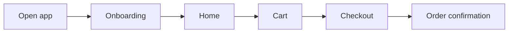
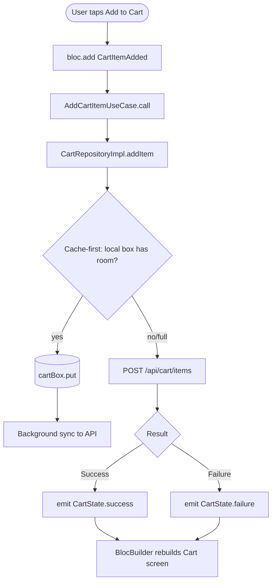

# Feature Development Plan — `$ARGUMENTS`

You are producing the **single source of truth** development plan for the feature/module: **`$ARGUMENTS`** in a Flutter application, written the way a senior/staff Flutter engineer would.

This document will be read by engineers, designers, and non-technical stakeholders. It must be:

- **Grounded** — every claim about existing code (Hive models, blocs, repositories, screens, widgets, routes) must come from the real repo, not guesses. Use Read/Grep/Glob to verify before writing.
- **Design-faithful** — every feature traces back to a real source (a `docs/`/`design/` folder, a Figma link, or a PRD the user supplies). Quote requirements verbatim.
- **Complete** — every one of the 11 steps below must appear, in order, even if a section is "N/A — <reason>".
- **Specific** — name real files with clickable links: [path/to/file.dart](path/to/file.dart).

---

## Repo context (auto-injected)

This command runs from whatever Flutter project the user is standing in when they invoke it — every injected command below is relative to the current working directory, never a hardcoded path.

- App package manifest: !`cat pubspec.yaml`
- Feature module tree: !`find lib/features -maxdepth 2 -type d`
- Core/shared layer tree: !`find lib/core -maxdepth 2 -type d`
- Top-level lib tree: !`find lib -maxdepth 1 -type d`
- Test tree: !`find test -maxdepth 3 -type d`
- Existing Hive typeId registry: !`cat lib/core/storage/hive_type_ids.dart 2>/dev/null`
- Existing router table: !`cat lib/core/router/app_router.dart 2>/dev/null`
- Existing DI setup: !`find lib/core/di -type f 2>/dev/null`
- **Design/requirement docs (read EVERY file before planning):** !`ls -1 docs 2>/dev/null` / !`ls -1 design 2>/dev/null`

---

## Rules (hard constraints — apply to every step)

These rules are non-negotiable. The plan must comply, and any existing code that violates them must be flagged.

1. **Feature-first Clean Architecture. Three layers per feature, strict inward-only dependency direction.**
   - `lib/features/<feature>/{data,domain,presentation}/`.
   - `domain/` — plain-Dart entities, abstract repository interfaces, and single-responsibility use cases (`class X implements UseCase<Type, Params>`, one exported class per file). **Zero imports of `package:flutter`, Hive, Dio, or any other package** — domain is pure Dart.
   - `data/` — models (`fromJson`/`toJson` + Hive `@HiveType`/`@HiveField` adapter, extends/implements the matching domain entity), datasources (`<x>_remote_datasource.dart` via the shared Dio client, `<x>_local_datasource.dart` via Hive), and a repository implementation that satisfies the `domain/` interface and maps every thrown exception to a typed `Failure`.
   - `presentation/` — bloc/cubit (events, states, the bloc itself), screens, and screen-local widgets.
   - Shared code that 2+ features need lives only in `lib/core/`.
   - A `data/` file importing `presentation/`, or a `domain/` file importing `package:flutter`/Hive/Dio, is a **defect** — flag it exactly like a rule violation, never wave it through as a "temporary shortcut".

2. **State management is flutter_bloc. `freezed` sealed unions are the one committed state-modeling convention, app-wide.**
   - Start with a `Cubit` for simple state; use a full `Bloc` when the feature needs to react to a distinct, traceable stream of user-intent events (per bloclibrary.dev guidance — Cubit can always be refactored up to Bloc later).
   - Events are past-tense, named `<BlocSubject><Noun><Verb>` (e.g. `ProfileAvatarUploaded`, `CartItemRemoved`), declared as a `sealed class` with `freezed` union members.
   - **States are always a `freezed` sealed union** — e.g. `Initial / Loading / Success(data) / Failure(message)` — never an `Equatable` class with a mutable-feeling `status` enum in one feature and a sealed union in another. One convention, everywhere, so any engineer can read any bloc the same way.
   - Blocs never touch `BuildContext`, Hive, or Dio directly — only domain use cases.
   - Widgets never call a repository or datasource directly — only `context.read<XBloc>().add(...)` / `context.read<XCubit>().doThing()`.
   - Bloc-to-bloc communication happens only in the presentation layer via `BlocListener` — never a direct bloc-to-bloc reference.

3. **Local storage is Hive, with a central typeId registry and one box per aggregate.**
   - Prefer `hive_ce` (the actively maintained fork) for new projects; if the target `pubspec.yaml` already pins classic `hive`/`hive_flutter`, respect that instead of forcing a migration mid-feature.
   - `lib/core/storage/hive_type_ids.dart` is the single source of truth for every `typeId` in the app — check it before assigning a new one; a collision is a defect.
   - Adapters are registered once, at startup, in `lib/core/storage/hive_initializer.dart`, before any box is opened.
   - Each aggregate gets exactly one box, opened only through that feature's `LocalDataSource` — never a `Hive.box()`/`Hive.openBox()` call scattered anywhere else.
   - Boxes holding tokens or PII are encrypted, with the key sourced from `flutter_secure_storage` — never a plaintext box for sensitive data.
   - Hive has no schema migration. Additive fields get a default value in the adapter. A breaking field change needs a versioned box name (e.g. `usersBoxV2`) plus a documented one-off migration function — state the outline in Step 4f, don't hand-wave it.

4. **DRY. Anything reusable lives in `lib/core/`, never duplicated per feature.**
   - `core/widgets/` — design-system primitives (buttons, inputs, loaders, empty-state, error-state). A screen never inlines a raw `ElevatedButton`/`TextField` styling block that duplicates an existing primitive.
   - `core/theme/` — the single `ThemeData`/`ThemeExtension` source of color, spacing, and type tokens. No inline `Color(0xFFxxxxxx)` or magic padding numbers in feature code.
   - `core/usecases/` — the generic `UseCase<Type, Params>` base class every use case implements.
   - `core/error/` — the `Failure` hierarchy and the app's chosen `Result<T>` type (Rule 11).
   - `core/network/` — one shared `Dio` instance with interceptors (auth header injection, logging, error mapping). No feature ever instantiates a second `Dio()`.
   - If a widget/util is about to be copy-pasted into a 2nd feature, this plan MUST include a "promote to `core/`" step: move the file, update every import, and confirm no behavior changed.

5. **Dependency injection is get_it + injectable. No manual wiring in widgets.**
   - Repository implementations, datasources, and use cases are annotated `@lazySingleton` or `@injectable` (singleton for stateless/cacheable services, injectable for anything that should be a fresh instance).
   - Blocs are `@injectable` and provided via `BlocProvider(create: (_) => getIt<XBloc>())` — never `XBloc(XRepositoryImpl(XRemoteDatasourceImpl(dio), XLocalDatasourceImpl(box)))` constructed inline inside a widget.
   - Every new injectable class triggers a `flutter pub run build_runner build` regeneration of the DI config — call this out in Step 11.

6. **Routing is go_router, guards live in one `redirect:` callback, not scattered per-screen checks.**
   - Every route is declared in `lib/core/router/app_router.dart` with a named route (`AppRoute.login.name`) — no raw path strings like `context.go('/login')` typed ad hoc elsewhere.
   - Auth/role guards are expressed once, in the router's `redirect:` callback, reading a shared auth state (e.g. an app-level `AuthBloc`/`AuthCubit` or session repository) — not an `if (!isLoggedIn)` check duplicated inside every protected screen's `initState`.
   - Persistent navigation shells (bottom nav bar, drawer) use `ShellRoute`, not a hand-rolled `IndexedStack` re-implementation per feature.

7. **Naming follows Effective Dart — not JavaScript/TypeScript conventions.**
   - Files: `snake_case.dart`. Classes, enums, typedefs, extension types: `UpperCamelCase`. Variables, functions, and **constants**: `lowerCamelCase` — Dart's official style guide deprecated `SCREAMING_CAPS` constants years ago; any `UPPER_SNAKE_CASE` Dart identifier in the plan or codebase is a defect to flag and fix.
   - One class (and, for widgets, one `Widget`) per file; the filename matches the primary class in snake_case (`profile_avatar_uploader.dart` → `class ProfileAvatarUploader`).

8. **Every screen and widget meets a Pro UI/UX bar — fully responsive AND platform-adaptive across iOS and Android. Not optional polish, the definition of done.**
   - **Responsive layout** — `LayoutBuilder`/`MediaQuery` verified across the real device spread: small phones, large phones, tablets, foldables — on **both** platforms, no brittle fixed-pixel containers that clip or break on any of them.
   - **Platform-adaptive behavior, not a shared Material skin reused as-is on iOS** — adaptive widgets (`Switch.adaptive`, `.adaptive` constructors, or a small adaptive layer in `core/widgets/` wrapping `Platform.isIOS`/`isAndroid`) so iOS gets Cupertino-appropriate feel (edge back-swipe gesture, iOS-style alerts/action sheets where warranted) and Android gets Material feel (system back button/gesture nav, Material ripple). `PageTransitionsTheme` is configured per platform in `core/theme/`.
   - **Safe-area correctness on both** — `SafeArea`/`MediaQuery.padding` handling for the iOS notch/Dynamic Island and the Android status bar + gesture-navigation inset. Every screen is verified against both, never assumed to "just work" cross-platform from a single reference device.
   - Light **and** dark theme from day one, driven entirely by `ThemeData`/`ThemeExtension` tokens — never a hardcoded color that only looks right in one mode.
   - Motion has intent: implicit animations (`AnimatedContainer`, `AnimatedOpacity`, etc.) for micro-interactions; a full `AnimationController` only when implicit widgets can't express the transition. A screen that snaps between states with no transition is a defect, not a shortcut.
   - Loading, empty, error, and success are each a **distinct, designed** state — pulled from `core/widgets/` (Rule 4), never a bare `CircularProgressIndicator()` floating in an otherwise blank `Scaffold`.
   - Baseline accessibility: `Semantics` labels on icon-only controls, minimum 44×44 logical-pixel tap targets, and text that respects the system font-scale setting (no `SizedBox` that clips text at 1.3x scale).
   - Step 2's per-screen notes must state the screen was checked against **both** an iOS and an Android reference device/simulator — never assumed.

9. **Every non-trivial piece of logic gets one brief, smart comment explaining *why*, never *what*.**
   - Use cases, repository methods, and bloc event handlers with a non-obvious branch (a retry policy, a cache-first-vs-network-first choice, why this particular box is encrypted, why a debounce duration was picked) get exactly one `//` line explaining the reasoning.
   - Never a comment that restates the method name or the next line of code. Never a multi-paragraph doc comment unless the class is a genuinely public, reused package API.

10. **400 LOC ceiling per file. Screens are thin — a `Scaffold` composing widgets, ~30 lines, no business logic inside `build()`. One widget per file.**

11. **Errors flow as a typed `Result<T>` end-to-end — from datasource, through repository and use case, to the bloc. Nothing throws across the domain boundary.**
    - Default: a small app-owned sealed `Result<T>` (`Success<T>` / `Failure`) built on Dart 3 sealed classes and exhaustive `switch` — no functional-programming package dependency required, and every engineer on the team can read it without knowing `dartz`/`fpdart` conventions.
    - If the target project already depends on `fpdart`/`dartz`, use its `Either<Failure, T>` instead and say so explicitly in Step 4 — **pick one, state which, and use it everywhere**; never mix both styles in the same app.
    - Datasources catch SDK-specific exceptions (`DioException`, `HiveError`, etc.) and map them to a typed `Failure` **only** at the data-layer boundary — the domain and presentation layers only ever see `Result<T>`/`Failure`, never a raw exception.

12. **Every bloc, repository, and critical screen ships with a test — and visual UI gets platform-aware golden tests, not just a widget test.**
    - Every bloc/cubit: `bloc_test` coverage asserting event → emitted-state sequences, including the failure path.
    - Every repository implementation: a `mocktail`-based unit test verifying it correctly maps datasource results/exceptions to `Result<T>`.
    - Every screen with meaningful custom UI (not a thin CRUD form): a **golden test** (`golden_toolkit` or Flutter's built-in `matchesGoldenFile`) pinning its visual appearance across light + dark theme **and** iOS + Android platform styling — adaptive widgets render differently per platform (Rule 8), so a single golden image isn't enough — in addition to a plain widget test for interaction behavior. This is what actually catches the "pixel drifted" regressions a widget test alone misses.
    - List these test files even when writing them is a follow-up step — the plan must name them, not silently skip testing.

13. **Code quality is enforced by tooling, not just by this document.**
    - `analysis_options.yaml` includes `flutter_lints` (or the stricter `very_good_analysis`) plus explicit rules for the conventions above where a lint exists (e.g. `always_use_package_imports`, `prefer_const_constructors`, `avoid_print`).
    - CI (or a documented local pre-commit step) runs `dart format --set-exit-if-changed .`, `flutter analyze --fatal-infos`, and `flutter test --coverage` before merge. If the target project has no CI wired up yet, Step 11 must list the workflow file to add.
    - A rule that only lives in this document and isn't checkable by a lint or a test will drift — call out in the plan which rules above are lint-enforced and which rely on review discipline.

14. **Secrets never live in source. `--dart-define` / `flutter_dotenv`, `.env` gitignored, `.env.example` checked in.**
    - Any new env var/API key the feature introduces is added to `.env.example` with a placeholder value, and to whatever typed config-loading class the app already uses (or a new one, named in Step 11, if none exists).

15. **Study the real design/requirement source before planning — never invent copy or colors.**
    - If the project has a `docs/`/`design/` folder, or the user supplies a Figma link/PRD in `$ARGUMENTS`'s context, read it **in full** before drafting any step, and add a top-of-document **"Source studied"** block listing every file read with a one-line summary of what it contributed.
    - Every plan step that draws on a specific source must cite it inline.
    - If no design source exists at all, the plan must say so explicitly in Step 1c and Step 2b ("no design source — applying `core/theme` tokens and Material 3 defaults") rather than silently inventing colors, spacing, or copy.
    - If any cited file is unreadable, STOP and report to the user before producing the plan.

---

## Before you start

1. Re-read the user's input: **`$ARGUMENTS`**. Identify whether it is a brand-new feature or a change to an existing one.
2. **Read every file under `docs/`/`design/` end-to-end**, if either exists (Rule 15). Cite each one in the plan's "Source studied" block.
3. Run a focused exploration of the repo for anything related to `$ARGUMENTS`:
   - `find lib/features -iname '*<keyword>*'` and grep across `lib/`
   - Check [lib/core/storage/hive_type_ids.dart](lib/core/storage/hive_type_ids.dart) — is a related Hive model already registered?
   - Check [lib/core/router/app_router.dart](lib/core/router/app_router.dart) — do related routes already exist?
   - Check for an existing bloc/cubit under any feature's `presentation/bloc/`.
   - Check [lib/core/widgets/](lib/core/widgets/) — is there already a primitive this feature should reuse instead of rebuilding?
4. Read `pubspec.yaml`. Confirm `flutter_bloc`, `hive`/`hive_ce`, `go_router`, `get_it`, `injectable` (and `freezed`/`json_serializable`/`bloc_test`/`mocktail` as dev deps) are present. If any are missing, add a "Step 0 — setup" note to the plan listing the exact `pubspec.yaml` additions needed.
5. Read any related repository, datasource, bloc, or widget **fully** before claiming it can be reused — don't guess reusability from a filename.
6. If `$ARGUMENTS` is empty or ambiguous, no `pubspec.yaml` is found in the working directory, or any cited design/docs file is unreadable, ask the user to clarify before producing the plan.

---

## Output format

Produce the plan below as a single markdown document with all 11 sections. Use clickable file links ([path](path)) for every reference to existing code. Mermaid diagrams must be inside ` ```mermaid ` fences.

---

### Step 1 — What is the feature

**a. High-level description** (3–6 sentences, written for a non-technical reader): what `$ARGUMENTS` does, who uses it, and the business value. Avoid jargon.

**b. Source citation** — quote the relevant section from the design/PRD source verbatim so reviewers can see the requirement. If none exists, state that explicitly (Rule 15).

**c. Status** — one of:
- **Built** — fully shipped; this plan is an as-is audit + delta list.
- **Partial** — some files exist; plan covers the gap.
- **New** — not yet started.

---

### Step 2 — Screens

**a. List of screens** with one-line description. Format:

- `Onboarding` — "First-run flow collecting the user's name and preferences"
- `Cart` — "Review items, adjust quantity, checkout"

For each screen, also state:

- Route path + name (go_router) after resolution (e.g. `/onboarding/profile-setup`, `AppRoute.profileSetup`)
- File path: `lib/features/<feature>/presentation/screens/<x>_screen.dart`
- New screen or modification of existing screen
- Which bloc/cubit powers it (name + file path)
- Responsive + platform-adaptive notes: phone/tablet/foldable breakpoints, and confirmation it was checked against **both** an iOS and an Android reference device/simulator (Rule 8)
- Has a widget test and, if visually meaningful, golden tests covering light/dark × iOS/Android? (Rule 12)

**b. Screen → design-source mapping table** — one row per screen, citing the exact source. Copy is taken verbatim from the cited design/PRD.

| Screen | Design source | Section / task | Copy strings to use verbatim (button labels, headings, validation messages) |
| --- | --- | --- | --- |
| `Onboarding` | design/figma-link or docs/spec.md | Task 2 — Onboarding | "Get started", "Skip for now" |

---

### Step 3 — User Journey (Mermaid)

**a. Non-technical Mermaid diagram** showing how an end user moves between screens. Plain English labels — no bloc names, no API paths.



---

### Step 4 — Data layer schema

> Reminder — Rule 3: every Hive model registers its `typeId` in the central registry; no collisions, no scattered box opens.
> Reminder — Rule 11: the app's chosen `Result<T>` (or `Either<Failure,T>` if the project already uses fpdart/dartz) is what every layer above the datasource actually sees.

**a. New Hive models** — for each: class name, file path under `lib/features/<feature>/data/models/`, `typeId` (from the central registry), box name, fields + types + constraints, purpose. Format:

```
### lib/features/<feature>/data/models/cart_item_model.dart
| Field       | Type    | Constraints                  | Purpose                |
|-------------|---------|-------------------------------|--------------------------|
| id          | String  | required, Hive key            | Local identity           |
| productId   | String  | required                      | Links to Product entity  |
| quantity    | int     | >= 1                           | Line-item quantity       |
| addedAt     | DateTime| required                      | Sort/expiry logic        |
```

**b. Remote DTO** — the API response shape each model maps from (field names, types), and the endpoint it comes from (cross-reference Step 6b).

**c. Domain entity** — the pure-Dart entity each model maps to/from: `lib/features/<feature>/domain/entities/<x>.dart`.

**d. Box registration** — box name, encrypted true/false (Rule 3), where it's opened (which `LocalDataSource`).

**e. Caching strategy** — state explicitly, per model: **cache-first** (serve local, refresh in background), **network-first** (always hit the API, fall back to cache offline), or **stale-while-revalidate** (serve local immediately, then emit a refreshed state when the network call resolves). This drives the bloc's event-handler logic in Step 10 — don't leave it implicit.

**f. Migration plan** — Hive adds new fields lazily via adapter defaults (no migration needed for additive changes). For a breaking change, outline the one-off migration function: open the old box, transform each record, write to the new versioned box, delete the old one.

---

### Step 5 — State management design (BLoC)

> Reminder — Rule 2: `freezed` sealed unions are the one state-modeling convention for the whole app. Blocs never touch Hive/Dio/BuildContext directly.

**a. New bloc/cubit** — for each, give:
- File path (`lib/features/<feature>/presentation/bloc/<x>_bloc.dart` + `_event.dart` + `_state.dart`)
- Events (past-tense list, per Rule 2's naming pattern)
- States (freezed sealed union members)
- Which use case(s) it calls
- Which screen(s) apply it

**b. Existing bloc/cubit** — for each, link to the file then either:
- _Reuse as-is_ — explain what it covers and why it fits
- _Modify_ — list the exact change and why

**c. Route guard application** — for each protected route, document the `redirect:` logic in `app_router.dart` (e.g. "no session in `AuthCubit.state` → redirect to `/login`").

**d. Cross-cutting concerns** (global error toast/snackbar listener, connectivity banner, etc.) — where they're wired (e.g., a top-level `BlocListener` wrapping `MaterialApp.router`). Flutter has no central middleware pipeline — each cross-cutting concern is explicitly wired, same as a route handler calling a helper explicitly.

---

### Step 6 — Routes

Split into **App routes** (go_router screens the user navigates to) and **API endpoints consumed** (the backend the app talks to). Both must be enumerated.

**a. App routes** — every route the feature exposes. Format:

```
/onboarding                  — "Onboarding"                [public]                              NEW
/onboarding/profile-setup    — "Profile setup"              [protected: authGuard redirect]       NEW
/cart                        — "Cart"                       [protected: authGuard redirect]       EXISTING (modify)
```

For each: path, one-line description, public vs protected (+ mechanism), NEW or EXISTING (link if existing), design-source task it maps to.

**b. API endpoints consumed** — segregated **Public** and **Protected/Authenticated**. Format exactly:

```
GET    /api/user/profile          — Fetch profile               [auth: Bearer token]   EXISTING
POST   /api/cart/items            — Add item to cart             [auth: Bearer token]   NEW
DELETE /api/cart/items/{id}       — Remove item from cart        [auth: Bearer token]   NEW
```

Rules for this table:
- Name the exact `RemoteDataSource` file that calls each endpoint.
- Mark each as NEW or EXISTING relative to the backend.
- Group by resource.
- Show request/response body shapes.

---

### Step 7 — Widgets

> Reminder — Rule 4: a widget used by 2+ screens MUST live in `lib/core/widgets/`, never duplicated in a screen-local `widgets/` folder.

**a. New widgets** — name, file path, purpose, parent screen(s), design-source task. For each, decide scope:
- **Single-screen** → `lib/features/<feature>/presentation/widgets/<Widget>.dart`
- **Shared (2+ screens)** → `lib/core/widgets/<Widget>.dart`

State the chosen scope and why. If unsure, default to single-screen; promote later.

**b. Existing widgets** — for each, link to the file then either:
- _Reuse as-is_ — exact import path
- _Modify_ — bullet list of the specific changes (props added, behavior changed, why)
- _Promote to `core/`_ — if a screen-local widget is now needed by a second screen: move the file, update every import, confirm no behavior change (Rule 4).

Verify reusability by actually reading the widget before claiming it fits.

---

### Step 8 — Third-party integrations

**a. List of packages/SDKs, each with use cases.** Format:

```
### Firebase Cloud Messaging (firebase_messaging)
- Push notification delivery for order-status updates
- New integration
- Env/config: google-services.json / GoogleService-Info.plist (not committed)
- Platform setup: Android manifest permission, iOS APNs capability
```

Cover every pub.dev package and native SDK the feature adds (payments, maps, camera, analytics, crash reporting, etc.). For each, state:
- New integration or extending existing usage
- Required config (env vars added to `.env.example` per Rule 14; platform config files like `google-services.json`/`GoogleService-Info.plist` — named, never committed with real values)
- Platform-specific setup: Android manifest permissions/entries, iOS `Info.plist`/capability entries
- Rate-limit/quota considerations if relevant

**Conditional deep-dive — Firebase / push notifications.** Apply this block **only if** `$ARGUMENTS` or the cited design source mentions Firebase Cloud Messaging, push notifications, or in-app notification delivery. **If the feature doesn't touch push/Firebase, skip this block entirely — do not add it to unrelated feature plans.** When triggered, the Firebase entry in Step 8a must also cover:

1. **Background handler constraint** — `FirebaseMessaging.onBackgroundMessage()` must be registered with a **top-level or static** function (`@pragma('vm:entry-point')`); state the exact file it lives in.
2. **Service placement** — push is cross-cutting, so the FCM listener setup lives in `lib/core/notifications/` (initialized once in `main.dart` before `runApp`), never inside one feature's `data/` layer (Rule 4).
3. **Device token registration/refresh as its own mini data-flow** — `getToken()` on startup/login and the `onTokenRefresh` stream both sync to a backend endpoint (e.g. `POST /api/devices/register`); this flow gets its own entry in Step 6b (API endpoints) and Step 10 (event handler breakdown), not just a prose mention here.
4. **Foreground display** — Android does not auto-show a system notification while the app is foregrounded; wire `flutter_local_notifications` to `FirebaseMessaging.onMessage` to display one manually.
5. **Permission request UX** — iOS `requestPermission()` and Android 13+ runtime `POST_NOTIFICATIONS` need an explicit bloc-driven "permission denied" state (per Rule 8's designed-states requirement), not just a manifest/plist entry.
6. **Deep-link on tap** — `FirebaseMessaging.onMessageOpenedApp` (app backgrounded) and `getInitialMessage()` (app terminated) must route into a specific go_router screen; cross-reference the exact route from Step 6a.

---

### Step 9 — End-to-end Mermaid flow (technical)

**a. Detailed flowchart** covering every operation: taps, form submits, conditions, guard checks, bloc events, use-case calls, repository calls, datasource calls (remote + local), cache-hit/miss branches (per Step 4e's stated strategy), and error paths.

This diagram is for engineers — include the event name and API method+path on edges, box names on Hive nodes, and decision diamonds for every condition.



---

### Step 10 — Bloc event handlers and per-handler logic

> Reminder — Rule 2: no business logic in the bloc itself beyond orchestration; the use case holds the logic.
> Reminder — Rule 11: every handler works in terms of `Result<T>`, never a raw try/catch around a Hive/Dio call.

**a. List every bloc/cubit** the feature touches. For each, give a numbered, sequential breakdown of every event handler.

Format:

```
### CartBloc — on<CartItemAdded> ([lib/features/cart/presentation/bloc/cart_bloc.dart](lib/features/cart/presentation/bloc/cart_bloc.dart))
1. emit(state.copyWith(status: CartStatus.loading)).
2. Call addCartItemUseCase(AddCartItemParams(productId, quantity)) — domain use case, no direct repository/datasource access from the bloc.
3. Use case calls CartRepository.addItem(), which applies the cache-first strategy from Step 4e: write to the local `cartBox` first, then queue a background sync POST to /api/cart/items.
4. Repository returns Result<CartItem>.
5. On Success: emit(state.copyWith(status: CartStatus.success, items: [...state.items, result.value])).
6. On Failure: emit(state.copyWith(status: CartStatus.failure, errorMessage: result.failure.message)).

Error paths:
- CacheFailure (Hive write failed) → emit failure state with "Could not save to cart locally"
- NetworkFailure (background sync failed) → item stays in local box marked unsynced; a SyncQueueWorker retries — this bloc does not block on it
- ValidationFailure (quantity <= 0) → caught before the use case call, emit failure state immediately, no repository call made
```

Cover **every** bloc, every event, every error branch. The bloc does **not**:
- Contain business logic (Rule 2) — that lives in the use case
- Call Hive or Dio directly (Rule 2) — goes through the repository
- Swallow a `Result.Failure` silently — every failure path reaches an emitted state

---

### Step 11 — Output feature folder structure

This is the final layout the implementation will produce. Copy-pasteable tree. Show NEW files explicitly, EXISTING files only when modified.

**a. Feature layer structure:**

```
lib/features/<feature>/
├── data/
│   ├── models/
│   │   └── <x>_model.dart              # fromJson/toJson + Hive adapter
│   ├── datasources/
│   │   ├── <x>_remote_datasource.dart  # Dio calls
│   │   └── <x>_local_datasource.dart   # Hive calls
│   └── repositories/
│       └── <x>_repository_impl.dart    # implements domain interface, maps to Result<T>
├── domain/
│   ├── entities/
│   │   └── <x>.dart
│   ├── repositories/
│   │   └── <x>_repository.dart         # abstract interface
│   └── usecases/
│       └── <use_case_name>.dart        # one class per action, single call() method
└── presentation/
    ├── bloc/
    │   ├── <x>_bloc.dart
    │   ├── <x>_event.dart
    │   └── <x>_state.dart              # freezed sealed union (Rule 2)
    ├── screens/
    │   └── <x>_screen.dart             # thin Scaffold, ~30 lines
    └── widgets/                         # screen-local only (Rule 4)
        └── <Widget>.dart
```

Plus, **outside the feature folder**, every shared file touched:

```
lib/core/widgets/<Widget>.dart          # promoted/new shared widget (Rule 4)
lib/core/theme/...                      # design tokens, extend only
lib/core/storage/hive_type_ids.dart     # append new typeId(s)
lib/core/storage/hive_initializer.dart  # register new adapter(s)
lib/core/router/app_router.dart         # append new GoRoute(s) + redirect logic
lib/core/di/injection.dart              # (or generated .config.dart) new @injectable registrations
lib/core/error/failure.dart             # new Failure subtype(s) if needed
lib/core/notifications/...              # only if Step 8's Firebase/push deep-dive was triggered
pubspec.yaml                            # new package deps
.env.example                            # new env var name(s), placeholder value
```

Hard rules for this layout:
- No file > 400 LOC (Rule 10).
- Screens ≤ ~30 lines.
- A widget in 2+ screens MUST be in `lib/core/widgets/`, never duplicated (Rule 4).
- No raw `ElevatedButton`/`TextField` styling blocks — use the `core/widgets/` primitives.
- No Hive/Dio import inside `presentation/` or `domain/` (Rule 1).
- `domain/` has zero `package:flutter` imports.
- Module-level constants are `lowerCamelCase` (Rule 7).

**b. Test files** (Rule 12):

```
test/features/<feature>/presentation/bloc/<x>_bloc_test.dart           # bloc_test event→state coverage
test/features/<feature>/data/repositories/<x>_repository_test.dart     # mocktail unit test
test/features/<feature>/presentation/screens/<x>_screen_test.dart      # widget test
test/features/<feature>/presentation/screens/<x>_screen_golden_test.dart # golden tests: light/dark × iOS/Android
```

**c. File-by-file delta table** — every NEW and MODIFIED file, with estimated LOC:

| # | Path | NEW / MODIFIED | Purpose | Est. LOC |
| --- | --- | --- | --- | --- |
| F1 | lib/features/<feature>/presentation/screens/<x>_screen.dart | NEW | Screen shell | 25 |
| F2 | lib/features/<feature>/presentation/bloc/<x>_bloc.dart | NEW | Event handlers | 90 |
| F3 | lib/features/<feature>/presentation/bloc/<x>_event.dart | NEW | freezed events | 20 |
| F4 | lib/features/<feature>/presentation/bloc/<x>_state.dart | NEW | freezed states | 25 |
| F5 | lib/features/<feature>/domain/usecases/<fn>.dart | NEW | Use case | 30 |
| F6 | lib/features/<feature>/domain/repositories/<x>_repository.dart | NEW | Abstract interface | 15 |
| F7 | lib/features/<feature>/data/repositories/<x>_repository_impl.dart | NEW | Impl + Result mapping | 70 |
| F8 | lib/features/<feature>/data/datasources/<x>_remote_datasource.dart | NEW | Dio calls | 50 |
| F9 | lib/features/<feature>/data/datasources/<x>_local_datasource.dart | NEW | Hive calls | 40 |
| F10 | lib/features/<feature>/data/models/<x>_model.dart | NEW | Model + Hive adapter | 60 |
| F11 | lib/core/storage/hive_type_ids.dart | MODIFIED | +1 typeId | +2 |
| F12 | lib/core/router/app_router.dart | MODIFIED | +N GoRoute + redirect | +10 |
| F13 | test/features/<feature>/presentation/bloc/<x>_bloc_test.dart | NEW | bloc_test event→state coverage | 60 |
| F14 | test/features/<feature>/data/repositories/<x>_repository_test.dart | NEW | mocktail unit test | 40 |
| F15 | test/features/<feature>/presentation/screens/<x>_screen_test.dart | NEW | widget test | 30 |
| F16 | test/features/<feature>/presentation/screens/<x>_screen_golden_test.dart | NEW | golden tests, light/dark × iOS/Android | 40 |
| ... | ... | ... | ... | ... |

---

## Final checks before delivering the plan

- [ ] Every existing-code reference is a real file you opened, not a guess.
- [ ] No cross-layer import violations: `data/` never imports `presentation/`; `domain/` never imports `package:flutter`, Hive, or Dio (Rule 1).
- [ ] Every event is past-tense and named `<Subject><Noun><Verb>`; every state is a freezed sealed union member, consistent with the rest of the app (Rule 2).
- [ ] No `BuildContext`, Hive, or Dio call inside any bloc; no repository/datasource call from any widget (Rule 2).
- [ ] Every new Hive model's `typeId` is registered in the central registry with no collision (Rule 3).
- [ ] Every box is opened only via a `LocalDataSource`; sensitive boxes are encrypted (Rule 3).
- [ ] No widget/util duplicated where it should have been promoted to `lib/core/` (Rule 4).
- [ ] Every new repository/datasource/use case/bloc has a `@lazySingleton`/`@injectable` registration (Rule 5).
- [ ] Every route is declared in the central `app_router.dart`; protected routes use the `redirect:` guard, not a per-screen check (Rule 6).
- [ ] All Dart identifiers follow Effective Dart casing; zero `UPPER_SNAKE_CASE` (Rule 7).
- [ ] Every screen has designed loading/empty/error/success states, works in light + dark theme, is platform-adaptive with safe-area handling checked on both iOS and Android, and meets baseline accessibility (Rule 8).
- [ ] Every non-trivial use case/repository method/event handler has exactly one why-comment (Rule 9).
- [ ] No file exceeds 400 LOC; no screen exceeds ~30 lines; one widget per file (Rule 10).
- [ ] Error handling is a typed `Result<T>` (or the project's existing `Either<Failure,T>`, explicitly named) end-to-end; no exception crosses the domain boundary (Rule 11).
- [ ] Every new bloc has a `bloc_test` file, every new repository has a `mocktail` test, every visually meaningful screen has a widget test and golden tests covering light/dark × iOS/Android (Rule 12).
- [ ] `analysis_options.yaml` lint coverage and a CI/pre-commit check (`flutter analyze --fatal-infos`, `flutter test --coverage`) are confirmed or added (Rule 13).
- [ ] No hardcoded secrets; new env vars added to `.env.example` (Rule 14).
- [ ] **A "Source studied" block lists every `docs/`/`design/` file read, or explicitly states none exists (Rule 15).**
- [ ] Every plan step that draws on a source file cites it inline.
- [ ] All copy strings are quoted verbatim from the design source — no paraphrasing.
- [ ] Both Mermaid diagrams render (no syntax errors, no parentheses-in-labels issues).
- [ ] Step 4 states an explicit caching strategy per Hive model, and a migration outline if the change is breaking.
- [ ] Step 6 includes BOTH app routes AND consumed API endpoints.
- [ ] Step 11 includes the feature tree, the shared-files list, the test-files list, AND the file-by-file delta table.
- [ ] **If, and only if, the feature touches Firebase/push notifications**, Step 8's conditional deep-dive (background handler, `core/notifications/` placement, token-sync flow, foreground display, permission UX, deep-link-on-tap) is fully covered — otherwise this item is N/A and no push/Firebase content was added.
- [ ] Step 1 is readable by a non-engineer; genuinely N/A sections say "N/A — <reason>" instead of being omitted.

---

## Save the plan to disk (final step — REQUIRED)

Once every check above passes, write the full plan to a file the user can read and edit.

1. **Derive a slug** from `$ARGUMENTS`:
   - Lowercase the entire string.
   - Trim leading/trailing whitespace.
   - Replace runs of whitespace and `_` with a single `-`.
   - Drop any character that isn't `[a-z0-9-]`.
   - Collapse repeated `-` to one; strip leading/trailing `-`.
   - Examples: `Onboarding` → `onboarding`; `Offline Cart Sync` → `offline-cart-sync`.

2. **Confirm overwrite if the file already exists.** If `plan/<slug>.md` is already present, the user has likely edited it. Read it first, show the user a 2-line summary of what's there, and ask whether to:
   - **Overwrite** with the new plan (their edits will be lost — offer to back up to `plan/<slug>.<timestamp>.md` first), OR
   - **Update in place** by merging the new findings into the existing file (preferred when the structure already matches), OR
   - **Write to a new file** like `plan/<slug>-v2.md` so both versions coexist.

   Do NOT overwrite without explicit confirmation.

3. **Create the directory if needed** and write the plan with the Write tool to:

   ```
   plan/<slug>.md
   ```

   (relative to the Flutter project's root — wherever this command is invoked from). Create `plan/` via `mkdir -p` if it doesn't exist yet.

4. **The file content is the entire rendered plan** — every step (1–11), every Mermaid diagram, every table, the "Source studied" block. Do not output a summary, a stub, or a link-only file.

5. **After writing**, output to the user (in chat) a short message — under 8 lines — containing:
   - The clickable plan path: [plan/<slug>.md](plan/<slug>.md)
   - One-line counts: `<N>` screens, `<N>` app routes, `<N>` API endpoints, `<N>` blocs, `<N>` widgets (NEW + reused), `<N>` design-source files studied.
   - Any open questions the user must resolve before implementation starts.
   - A reminder that the user can edit `plan/<slug>.md` and re-run `/feature-flutter-plan <module-name>` to refresh, or hand the plan to an implementation agent.

6. **Do not begin editing source code.** The command stops at "plan written + summary printed." Implementation is a separate user-initiated step.
