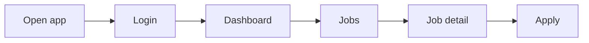
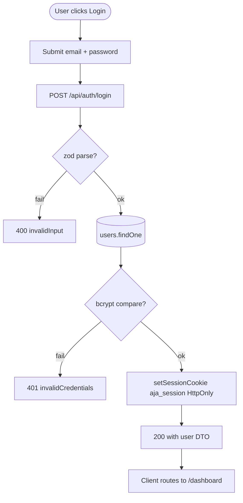

# Feature Development Plan — `$ARGUMENTS`

You are producing the **single source of truth** development plan for the feature/module: **`$ARGUMENTS`** in the AI-Job-Applier codebase.

This document will be read by engineers, designers, and non-technical stakeholders. It must be:

- **Grounded** — every claim about existing code (collections, route handlers, services, components) must come from the real repo, not guesses. Use Read/Grep/Glob to verify before writing.
- **Docs-faithful** — every feature traces back to the source in `docs/` (Next_Phase1.docx for architecture, Next_Phase2.docx for the 19-task backlog). Quote requirements verbatim.
- **Complete** — every one of the 11 steps below must appear, in order, even if a section is "N/A — <reason>".
- **Specific** — name real files with clickable links: [path/to/file.ts](path/to/file.ts).

---

## Repo context (auto-injected)

- App package.json: !`cat /Users/daxesh/satyam-reuse-things/AI-Job-Applier/package.json`
- App router tree: !`find /Users/daxesh/satyam-reuse-things/AI-Job-Applier/src/app -maxdepth 4 -type d`
- API route files: !`find /Users/daxesh/satyam-reuse-things/AI-Job-Applier/src/app/api -name 'route.*'`
- Server tree: !`find /Users/daxesh/satyam-reuse-things/AI-Job-Applier/src/server -maxdepth 3 -type d`
- Auth guards: !`find /Users/daxesh/satyam-reuse-things/AI-Job-Applier/src/server/auth -type f`
- Mongoose models: !`find /Users/daxesh/satyam-reuse-things/AI-Job-Applier/src/server/models -type f`
- Services: !`find /Users/daxesh/satyam-reuse-things/AI-Job-Applier/src/server/services -type f`
- Shared components: !`find /Users/daxesh/satyam-reuse-things/AI-Job-Applier/src/components -type f -name '*.tsx'`
- **Docs (read EVERY file before planning):** !`ls -1 /Users/daxesh/satyam-reuse-things/AI-Job-Applier/docs`

---

## Rules (hard constraints — apply to every step)

These rules are non-negotiable. The plan must comply, and any existing code that violates them must be flagged.

1. **camelCase keys end-to-end. Never map the same key in different formats.**
   - Every JSON key — request body, response body, frontend type field, hook payload, Mongoose schema path, sub-document field, `localStorage`/`sessionStorage` value — must be camelCase.
   - Manual translation like `{ apiKey: row.api_key }` or `{ document_type: form.documentType }` is a **defect**, never a "translation seam". The zod schema key, the route handler `body.<key>` read, the response field, the Mongoose path, the DTO field, and the form-state field must all share the **same identifier**.
   - String identifier values used as JSON keys or enum discriminators (e.g. provider slugs like `"gemini"`, `"openai"`, `"claude"`, `"groq"`, `"ollama"`) stay lowercase camelCase.
   - If `$ARGUMENTS` touches any code where casing diverges, list every divergence in Step 4 and Step 10 and propose the unifying fix in this same plan.

2. **Auth guards live as flat files under `src/server/auth/`. No per-guard subfolders.**
   - Page guards: `requireUser` redirects to `/login`; `requireAdmin` redirects to `/dashboard`.
   - API guards: `getSession()` from [src/server/auth/session.ts](src/server/auth/session.ts) returns the payload or null; route handlers should call it and return `401` themselves (use `fail("unauthorized", 401)` from [src/lib/http.ts](src/lib/http.ts)).
   - There is no Express middleware layer. Cross-cutting concerns (rate-limit, CSRF, audit logging) belong in a new flat file under `src/server/auth/` or `src/server/middleware/` and are explicitly invoked inside the route handler.
   - Step 5 must enumerate guards using this exact flat-file convention.

3. **Cookies are set on the server inside the route handler via `setSessionCookie` (Next.js `cookies()`), not from `'use client'` code.**
   - The session cookie (`aja_session`) is HttpOnly — it CANNOT be set from the browser. Server route handlers call [src/server/auth/session.ts](src/server/auth/session.ts) `setSessionCookie()` after a successful login/register response.
   - Non-HttpOnly UI preferences (theme, last-used filter) MAY be written from the client.
   - Step 10 controller breakdowns must distinguish HttpOnly cookies (server-set) from client-set preferences.

4. **No business logic in route handlers.** The Next.js route handler in `src/app/api/<...>/route.ts` parses input (zod), calls a function in `src/server/services/<area>/<fn>.ts`, and returns the response via `ok()`/`fail()` from [src/lib/http.ts](src/lib/http.ts). All logic lives in services.

5. **No Mongoose or `@google/genai` (or any LLM SDK) in `'use client'` files.** Browser-side code calls `/api/*` only. Server services touch the DB and the LLM SDKs.

6. **Every API key on the wire mirrors a service-layer field 1:1.** No discriminator arrays where storage is a single field, no extra fields the model doesn't have.

7. **Module-scope constants are `UPPER_SNAKE_CASE`. Local variables are camelCase.**
   - Identifier name uses uppercase letters with underscores (e.g. `MATCH_STATUSES`, `AI_PROVIDER_NAMES`).
   - This applies to every `const X = ...` declared at module top level (option lists, regex, message bundles).
   - The VALUES inside those constants — especially string keys used as JSON keys — still follow Rule 1 (camelCase). Example:
     ```ts
     export const AI_PROVIDER_NAMES = ["gemini", "openai", "claude", "groq", "ollama"] as const;
     export const ERROR_MESSAGES = { invalidEmail: "..." } as const;
     ```

8. **Shared components belong in `src/components/`, not duplicated per page.**
   - If a component is rendered by 2 or more pages, it MUST live under `src/components/...` and be imported.
   - A page-local `_components/` is only for components used by exactly one page.
   - One component per file. **No raw DOM (`<button>`, `<input>`, `<form>`, etc.) inside `page.tsx`** — pages are thin shells (10–30 LOC) composing components.
   - When the plan proposes a new component, decide upfront where it lives. If you discover an existing page-local component is now needed by a second page, the plan must include a "promote to global" step.

9. **Every route folder ships the triad: `page.tsx` + `error.tsx` + `loading.tsx`.**
   - `error.tsx` and `loading.tsx` use the project's primitives — [src/components/ErrorState.tsx](src/components/ErrorState.tsx) and [src/components/PageLoading.tsx](src/components/PageLoading.tsx) — wired in 3–5 line shells.
   - Custom UI only when a route genuinely needs a different visual; state the reason if you propose a custom file.

10. **All LLM calls go through `src/server/services/llm/`. Prompts live in `src/server/services/llm/prompt/`.**
    - Per CLAUDE.md, each `services/llm/<fn>.ts` holds orchestration + zod-validated parser only; the prompt builder lives in the paired `services/llm/prompt/<fn>.ts`.
    - Provider routing goes through [src/server/services/llm/resolver.ts](src/server/services/llm/resolver.ts) which returns an `LlmAdapter` for the user's active provider (gemini/openai/claude/groq/ollama).
    - No inline LLM calls in route handlers. No prompt strings in services or route handlers.
    - Step 10 must show every LLM-using route delegating through `resolver.getActiveAdapter(userId)` and a `services/llm/<fn>.ts` function.

11. **Server-only route handlers using Mongoose / pdf-parse / mammoth / LLM SDKs set `export const runtime = "nodejs"`.** No Edge runtime for these. State this in Step 6 for every protected backend route the feature adds.

12. **Study EVERY file under `docs/` before writing any step of the plan.**
    - The folder is the product brief. Each file (Next_Phase1.docx, Next_Phase2.docx, etc.) contains flow, planning, copy, or spec details the implementation must honor.
    - Read **all** of them in full before drafting the plan.
    - **NOTE on the docx files in this repo:** [docs/Next_Phase1.docx](docs/Next_Phase1.docx) and [docs/Next_Phase2.docx](docs/Next_Phase2.docx) are stored as plain UTF-8 text (the .docx extension is a mislabel). Read them with `cat` / Read directly. The root-level [AI_Job_Application_Agent_Documentation.docx](AI_Job_Application_Agent_Documentation.docx) IS a real Word file — extract it with `mammoth` (already a dependency): `node -e "require('mammoth').extractRawText({path:'AI_Job_Application_Agent_Documentation.docx'}).then(r=>console.log(r.value))"`.
    - In the plan, add a top-of-document **"Source studied"** block listing every file read with a one-line summary of what it contributed.
    - **If any file is unreadable**, STOP and report to the user before producing the plan.
    - Each plan step that draws on a specific source file must cite it inline.

13. **Secrets only in `.env.local` (gitignored). Validate via [src/lib/env.ts](src/lib/env.ts).**
    - When the plan introduces a new env var, add it to both [.env.example](.env.example) and the zod schema in [src/lib/env.ts](src/lib/env.ts).
    - User-provided API keys (LLM, JSearch, future job-platform tokens) are encrypted at rest via [src/server/crypto/secretBox.ts](src/server/crypto/secretBox.ts) (AES-256-GCM) and stored as a `Sealed` sub-document. Plain-text storage of user-provided secrets is a defect.

14. **400 LOC ceiling per file. `page.tsx` ≤ 30 lines (thin shell). One component per file.**
    - If the plan's component LOC estimates exceed 400, split before scaffolding.

---

## Before you start

1. Re-read the user's input: **`$ARGUMENTS`**. Identify whether it is a brand-new feature or a change to an existing one.
2. **Read EVERY file under [docs/](docs/) end-to-end** (Rule 12). Cite each one in the plan's "Source studied" block.
3. Run a focused exploration of the repo for any existing code related to `$ARGUMENTS`:
   - Grep across `src/`
   - Check [src/server/models/](src/server/models/) — is there already a Mongoose model?
   - Check [src/app/api/](src/app/api/) — are there existing routes?
   - Check [src/server/services/](src/server/services/) — are there existing services?
   - Check [src/server/auth/](src/server/auth/) — what guards exist?
4. Read [src/server/models/](src/server/models/) to know the current schema before proposing changes.
5. Read any related route handler, service, or component **fully** before claiming it can be reused.
6. If `$ARGUMENTS` is empty or ambiguous, OR if any file under `docs/` is unreadable, ask the user to clarify before producing the plan.

---

## Output format

Produce the plan below as a single markdown document with all 11 sections. Use clickable file links ([path](path)) for every reference to existing code. Mermaid diagrams must be inside ` ```mermaid ` fences.

---

### Step 1 — What is the feature

**a. High-level description** (3–6 sentences, written for a non-technical reader): what `$ARGUMENTS` does, who uses it, and the business value. Avoid jargon.

**b. Source citation** — quote the relevant section from `docs/Next_Phase2.docx` (or the source doc) verbatim so reviewers can see the requirement.

**c. Status** — one of:
- **Built** — fully shipped; this plan is an as-is audit + delta list.
- **Partial** — some files exist; plan covers the gap.
- **New** — not yet started.

---

### Step 2 — Pages

**a. List of pages** with one-line description. Format:

- `Login` — "Log in with email/mobile + password (Nylas Google login deferred)"
- `Jobs` — "Search & filter ingested jobs with match scores"

For each page, also state:

- Route URL after Next.js group resolution (e.g., `/(auth)/login` → `/login`)
- File path: `src/app/<feature>/page.tsx`
- New page or modification of existing page
- Server component vs client component (and why)
- Has `error.tsx` + `loading.tsx`? (Rule 9)

**b. Page → docs mapping table** — one row per page, citing the exact `docs/` source. Pixel-perfect design is N/A for this project (no design HTML); copy is taken verbatim from `docs/Next_Phase2.docx` task descriptions.

| Page    | Source doc                    | Section / task               | Copy strings to use verbatim (button labels, headings, validation messages)         |
| ------- | ----------------------------- | ---------------------------- | ----------------------------------------------------------------------------------- |
| `Login` | docs/Next_Phase2.docx         | Task 2 — Login System        | "Sign in", "Email + Password", "Mobile Number + Password"                            |

---

### Step 3 — User Journey (Mermaid)

**a. Non-technical Mermaid diagram** showing how an end user moves between pages. Use plain English labels — no internal API names, no Mongoose collections.



---

### Step 4 — Database schema (Mongoose)

> Reminder — Rule 1: every Mongoose schema path and every sub-document field MUST be camelCase. No `snake_case`. No `{ camelCase: snake_case }` mappers anywhere.

**a. New models** — for each, give: model name (PascalCase, exported), collection name (camelCase plural, inferred), file path under [src/server/models/](src/server/models/), fields with types + constraints, and purpose. Format:

```
### src/server/models/AutoApplyRun.ts
| Field             | Type                          | Constraints                  | Purpose                  |
|-------------------|-------------------------------|------------------------------|--------------------------|
| userId            | Schema.Types.ObjectId, ref:User | required, indexed          | Owning user              |
| jobId             | Schema.Types.ObjectId, ref:Job  | required, indexed          | Target job               |
| status            | string                        | enum: pending|filling|submitted|failed | Pipeline stage |
| confidence        | number                        | 0–100                        | Auto-vs-review threshold |
| answeredQuestions | nested array                  | { question, answer, source } | Audit trail              |
| createdAt/updatedAt | Date                        | timestamps: true             | Audit                    |
```

**b. Modifications to existing models** — read [src/server/models/](src/server/models/) first. State exact field additions/removals/renames and the model they apply to. If you find any `snake_case` field related to `$ARGUMENTS`, propose a rename to camelCase as part of this plan.

**c. References (Mongoose refs, MongoDB has no FKs)** — for each ref, give a one-line doc comment explaining the relationship and cleanup behavior. Format:

```
- AutoApplyRun.userId → User._id  // run is owned by exactly one user; deleting the user orphans runs (no cascade in Mongoose — add a pre-remove hook on User if needed)
- AutoApplyRun.jobId  → Job._id   // each run targets one job
```

**d. Indexes** — list each index with kind, fields, and reason. Example:

```
- single index on userId               // accelerates "list my runs" (Step 6 GET /api/auto-apply)
- compound unique (userId, jobId)      // one run per (user, job) pair
- single index on createdAt -1         // dashboard "latest activity" sort
```

**e. Other constraints** — `required`, `default`, `enum`, `unique`, `sparse`, validators. MongoDB has no row-level security — auth is enforced in service layer via `userId` filter on every read/write.

**f. Migration plan** — Mongoose adds new fields lazily (no migration file needed for additive changes). For renames or required-field backfills, write a one-off Node script that connects via [src/server/db/connect.ts](src/server/db/connect.ts) and walks documents. Show the script outline.

---

### Step 5 — Auth guard / cross-cutting identification

> Reminder — Rule 2: guards are flat files under `src/server/auth/`. No subfolders.

**a. New guards needed** — for each, give:

- File path (must be `src/server/auth/<guardName>.ts`, flat)
- Default export signature
- What it checks / mutates on the request
- Which pages / routes apply it (mounted by calling inside the page or route handler)

**b. Existing guards** — for each entry under [src/server/auth/](src/server/auth/), link to the file then either:

- _Reuse as-is_ — explain what it covers and why it fits this feature
- _Modify_ — list the exact change and why

**c. Application order** — for each protected route, document the call order in the route handler (e.g. `getSession() → fail 401 if null → call service → ok(data)`).

**d. Cross-cutting concerns (rate-limit, CSRF, audit logging)** — if `$ARGUMENTS` introduces any, propose where they live. There is no central middleware pipeline; each route handler invokes them explicitly.

---

### Step 6 — Routes

Split into **Frontend routes** (Next.js pages users navigate to) and **API routes** (route handlers under `src/app/api/`). Both must be enumerated.

**a. Frontend routes** — every page URL the feature exposes. Format:

```
/login                  — "Login"                          [public]   EXISTING (modify) [src/app/(auth)/login/page.tsx](src/app/(auth)/login/page.tsx)
/jobs                   — "Job search"                     [protected: requireUser]  EXISTING (modify)
/jobs/[id]              — "Job detail"                     [protected: requireUser]  EXISTING
/jobs/[id]/auto-apply   — "Auto-apply run viewer"          [protected: requireUser]  NEW
```

For each frontend route:

- URL path (final, after Next.js group resolution)
- One-line user-facing description
- Public vs protected (and what the protection mechanism is — `await requireUser()` at the top of `page.tsx`)
- NEW or EXISTING (link to the file if existing)
- Source doc task it maps to (Rule 12)

**b. API routes** — segregated into **Public** and **Protected**. Format exactly:

```
POST   /api/auth/login                   — Login                           [public]                EXISTING
GET    /api/auth/me                      — Get my profile                  [protected: getSession] EXISTING
GET    /api/auto-apply                   — List my runs                    [protected: getSession] NEW
POST   /api/auto-apply                   — Start a run                     [protected: getSession] NEW
GET    /api/auto-apply/[id]              — Run detail                      [protected: getSession] NEW
PATCH  /api/auto-apply/[id]/approve      — Approve review-required run     [protected: getSession] NEW
```

Rules for the API table:

- For every protected route, name the **exact guard** from [src/server/auth/](src/server/auth/).
- Mark each route as **NEW** or **EXISTING** (link to the route handler file if existing).
- Group by resource (`/auth`, `/jobs`, `/auto-apply`, …).
- Request and response bodies must use camelCase keys (Rule 1).
- Every NEW route handler must declare `export const runtime = "nodejs"` (Rule 11).

---

### Step 7 — Components

> Reminder — Rule 8: a component used by 2+ pages MUST live in `src/components/...`, never in a page-local `_components/`. Never duplicate.

**a. New components** — name, file path, purpose, parent page(s), and the docs source task.

For each new component, decide its scope:

- **Single-page** → place at `src/app/<feature>/_components/<Component>.tsx`
- **Shared (2+ pages)** → place at `src/components/<Component>.tsx`

State the chosen scope and the reason. If unsure whether it will be reused, default to single-page; the plan can promote it later.

**b. Existing components** — for each, link to the file then either:

- _Reuse as-is_ — exact import path
- _Modify_ — bullet list of the specific changes (props added, behavior changed, why)
- _Promote to global_ — if a page-local component is now needed by `$ARGUMENTS` too, the plan MUST include a "promote to global" step: move the file to `src/components/...`, update all imports, and verify no behavior change.

Verify reusability by actually reading the component before claiming it fits — do not guess from filenames.

---

### Step 8 — Third-party integrations

**a. List of tools, each with use cases**. Format:

```
### Gemini (via @google/genai)
- Skill extraction from resume text
- Resume tailoring per job description
- Cover letter generation
- Interview question generation
- Answer generation for application Q&A
```

Cover: Gemini / OpenAI / Anthropic / Groq / Ollama, Nylas, JSearch (RapidAPI), MongoDB, pdf-parse, mammoth, bcryptjs, jsonwebtoken, and any new third party `$ARGUMENTS` brings in. For each, state:

- New integration or extending existing usage
- Env vars required (name only, never values) — added to both [.env.example](.env.example) and the zod schema in [src/lib/env.ts](src/lib/env.ts)
- Rate-limit / quota considerations
- For user-provided keys: encryption strategy ([src/server/crypto/secretBox.ts](src/server/crypto/secretBox.ts))

---

### Step 9 — End-to-end Mermaid flow (technical)

**a. Detailed flowchart** covering every operation: button clicks, form submits, conditions, auth checks, API calls, DB writes, third-party calls, error paths, and any cookie writes (HttpOnly cookies are set server-side; client-only UI prefs are set client-side).

This diagram is for engineers — include API method+path on edges, collection names on DB nodes, guard names on guard diamonds, and decision diamonds for every condition.



---

### Step 10 — Route handlers and per-route logic

> Reminder — Rule 4: no business logic in route handlers; delegate to services.
> Reminder — Rule 10: every LLM-using route uses `resolver.getActiveAdapter(userId)` + a `services/llm/<fn>.ts` function. No inline prompt strings.

**a. List every API route handler** the feature touches. For each, give a numbered, sequential breakdown of every step.

Format:

```
### POST /api/auth/login  ([src/app/api/auth/login/route.ts](src/app/api/auth/login/route.ts))
1. Parse body with zod schema { email | mobile, password } (camelCase keys per Rule 1).
2. Connect to MongoDB via dbConnect() from [src/server/db/connect.ts](src/server/db/connect.ts).
3. Look up user in User collection by email or mobile.
4. bcrypt.compare(body.password, user.passwordHash).
5. On match: setSessionCookie({ userId, email }) from [src/server/auth/session.ts](src/server/auth/session.ts) — server-set HttpOnly per Rule 3.
6. Return ok(userDto) via [src/lib/http.ts](src/lib/http.ts).

Error paths:
- zod failure → fail("invalidInput", 400)
- user not found / wrong password → fail("invalidCredentials", 401)
- unexpected exception → handleError(err) → 500 with { error: "internalError" }
```

Cover **every** route handler, every condition, every error branch. Reference helpers by file:line. The route handler does **not**:

- Contain business logic (Rule 4) — that lives in `services/`
- Map `snake_case ↔ camelCase` (Rule 1) — keys are identical at every layer
- Call an LLM SDK directly (Rule 10) — goes through resolver + services/llm/<fn>.ts

---

### Step 11 — Output frontend & backend folder structure

This is the final layout the implementation will produce. It must be a complete, copy-pasteable tree the engineer can scaffold from. Show NEW files explicitly and EXISTING files only when they will be modified.

**a. Frontend structure** (feature-local under the page folder; leading underscore = not a route, per Next.js convention):

```
src/app/<feature>/
├── page.tsx                   # thin shell, 10–30 lines, await requireUser() + <FeatureView/>
├── error.tsx                  # 3-line shell using <ErrorState/> primitive (Rule 9)
├── loading.tsx                # 3-line shell using <PageLoading/> primitive (Rule 9)
├── _components/               # ONLY components used by this single page (Rule 8). PascalCase.tsx + matching .module.css
│   ├── <Feature>View.tsx      # client entry; wires hooks + primitives
│   ├── <Feature>View.module.css
│   └── ...
├── _hooks/                    # feature-local hooks only (cross-feature hooks live in src/hooks/)
│   └── use<Feature>.ts
└── _types/index.ts            # request/response + view-model types (camelCase fields per Rule 1)
```

Plus, **outside the page folder**, list every shared file the feature touches:

```
src/components/<Component>.tsx     # any component shared by 2+ pages (Rule 8)
src/components/<Component>.module.css
src/types/index.ts                 # shared DTOs / enums (UPPER_SNAKE constants per Rule 7)
src/styles/tokens.css              # design tokens (extend only — these are app-wide)
src/lib/apiClient.ts               # add typed wrapper if calling new endpoints
src/lib/env.ts                     # add zod schema entry for any new env var
.env.example                       # add new env var name with placeholder value
```

Hard rules for the frontend layout:

- No file > 400 LOC.
- `page.tsx` ≤ 30 lines (thin shell only).
- `loading.tsx` and `error.tsx` use the global primitives unless the route legitimately needs custom UI (Rule 9).
- A component appearing in 2+ pages MUST be moved to `src/components/...`, not duplicated (Rule 8).
- Module-scope constant identifiers are UPPER_SNAKE_CASE (Rule 7).
- No raw `<button>`, `<input>` — use [src/components/Button.tsx](src/components/Button.tsx) and [src/components/Input.tsx](src/components/Input.tsx) primitives.
- No `useMemo`/`useCallback` unless profiling shows a measurable win.
- No Mongoose / LLM SDK imports in any `'use client'` file (Rule 5).
- All client → server calls go through [src/lib/apiClient.ts](src/lib/apiClient.ts) `apiFetch`.

**b. Backend structure** — services live under `src/server/services/<area>/`. Route handlers in `src/app/api/<resource>/route.ts` are thin wrappers that parse + delegate. Guards are flat under `src/server/auth/`.

```
src/app/api/<resource>/
├── route.ts                              # thin Next.js handler; export const runtime = "nodejs"; imports services
└── [param]/route.ts                      # for item-level endpoints (also a thin wrapper)

src/server/services/<area>/               # one folder per backend area (auth, jobs, resume, llm, nylas, qna, stats)
├── <fn>.ts                               # one exported function per file; no shared "service.ts" god-file
└── ...

src/server/services/llm/                  # all LLM orchestration (Rule 10)
├── resolver.ts                           # selects active provider adapter
├── adapters/                             # gemini, openai, claude — one file per provider
├── prompt/<fn>.ts                        # one prompt builder per LLM function
├── <fn>.ts                               # orchestration + zod parser (paired with prompt/<fn>.ts)
└── ...

src/server/models/                        # Mongoose schemas — one model per file
└── <Model>.ts

src/server/auth/                          # FLAT files only — no subfolders (Rule 2)
├── requireUser.ts
├── requireAdmin.ts
├── session.ts
└── jwt.ts

src/server/crypto/
└── secretBox.ts                          # AES-256-GCM Sealed wrapper for user secrets (Rule 13)

src/server/db/
└── connect.ts                            # cached mongoose connection
```

Per-file expectations:

- **Models** — Mongoose schema; camelCase paths (Rule 1); `timestamps: true` unless audit not needed; refs declared explicitly. Indexes declared with `schema.index(...)`. Models exported PascalCase via `mongoose.models.X || mongoose.model(...)` (hot-reload safe).
- **Services** — one function per file. Pure server code. Imports Mongoose + LLM SDKs only here. Returns plain camelCase objects (use [src/server/serializers.ts](src/server/serializers.ts) for DB → DTO).
- **Route handlers** — parse with zod, await `dbConnect()` if touching DB, call service, return `ok(data)` / `fail(msg, code)` / `handleError(err)` from [src/lib/http.ts](src/lib/http.ts). 3–10 lines of body each.
- **LLM functions** — orchestration in `services/llm/<fn>.ts`, prompt in `services/llm/prompt/<fn>.ts`. Output validated with zod schema (or `zod-to-json-schema` for structured output).

Hard rules for the backend layout:

- Route handlers contain ZERO business logic — they delegate to a service function (Rule 4).
- Every error path returns a JSON `{ error: <camelCaseCode> }` via [src/lib/http.ts](src/lib/http.ts) helpers; no thrown HTML.
- Auth guards are flat under `src/server/auth/<name>.ts` (Rule 2).
- User-provided secrets are sealed with `secretBox.encrypt(...)` (Rule 13).
- Every Mongoose path is camelCase (Rule 1).
- Module-scope constants are UPPER_SNAKE_CASE (Rule 7).

**c. File-by-file delta table** — list every NEW and MODIFIED file the implementation will produce, with estimated LOC:

| #   | Path                                               | NEW / MODIFIED  | Purpose                                     | Est. LOC |
| --- | -------------------------------------------------- | --------------- | ------------------------------------------- | -------- |
| F1  | src/app/<feature>/page.tsx                         | NEW             | Page shell                                  | 20       |
| F2  | src/app/<feature>/loading.tsx                      | NEW             | 3-line shell using <PageLoading/>           | 3        |
| F3  | src/app/<feature>/error.tsx                        | NEW             | 3-line shell using <ErrorState/>            | 3        |
| F4  | src/app/<feature>/\_components/<Feature>View.tsx   | NEW             | Client entry                                | 180      |
| F5  | src/components/<Shared>.tsx                        | NEW             | Shared component (Rule 8)                   | 80       |
| B1  | src/app/api/<resource>/route.ts                    | NEW             | Thin wrapper → services                     | 30       |
| B2  | src/server/services/<area>/<fn>.ts                 | NEW             | Service function                            | 90       |
| B3  | src/server/services/llm/<fn>.ts                    | NEW             | LLM orchestration (Rule 10)                 | 50       |
| B4  | src/server/services/llm/prompt/<fn>.ts             | NEW             | Prompt builder                              | 40       |
| B5  | src/server/models/<Model>.ts                       | NEW             | Mongoose schema                             | 50       |
| B6  | src/server/auth/<guardName>.ts                     | NEW (optional)  | New flat guard                              | 30       |
| B7  | src/types/index.ts                                 | MODIFIED        | Append new DTO / enum                       | +20      |
| B8  | src/lib/env.ts                                     | MODIFIED        | Add new env var to zod schema               | +2       |
| B9  | .env.example                                       | MODIFIED        | Document new env var name                   | +1       |
| ... | ...                                                | ...             | ...                                         | ...      |

---

## Final checks before delivering the plan

- [ ] Every existing-code reference is a real file you opened, not a guess.
- [ ] Every API key, Mongoose path, sub-document field, and TypeScript field in the plan is camelCase (Rule 1). No manual mappers anywhere.
- [ ] Every guard path follows the FLAT pattern `src/server/auth/<guardName>.ts` (Rule 2).
- [ ] HttpOnly session cookies are set in the route handler via `setSessionCookie` (Rule 3); only non-HttpOnly UI prefs may be client-set.
- [ ] No business logic in route handlers (Rule 4) — `src/app/api/.../route.ts` only delegates to a service function.
- [ ] Every protected route names its guard (`getSession` for APIs, `requireUser` / `requireAdmin` for pages).
- [ ] Every LLM call goes through [src/server/services/llm/resolver.ts](src/server/services/llm/resolver.ts) + a paired `services/llm/<fn>.ts` + `services/llm/prompt/<fn>.ts` (Rule 10).
- [ ] Every NEW backend route declares `export const runtime = "nodejs"` (Rule 11).
- [ ] User-provided API keys are sealed via [src/server/crypto/secretBox.ts](src/server/crypto/secretBox.ts) (Rule 13).
- [ ] Module-scope constant identifiers are UPPER_SNAKE_CASE (Rule 7); their string values follow Rule 1.
- [ ] Components used by 2+ pages live under `src/components/...`, not inside any page-local `_components/` (Rule 8). Promotion steps are listed if applicable.
- [ ] Every page has the route triad (`page.tsx` + `error.tsx` + `loading.tsx`), with `error.tsx` / `loading.tsx` using shared primitives unless custom UI is justified (Rule 9).
- [ ] **A "Source studied" block at the top of the plan lists EVERY file under `docs/` with a one-line summary (Rule 12). Zero files skipped.**
- [ ] **Every plan step that draws on a source file cites it inline.**
- [ ] All copy strings in the plan are quoted verbatim from the docs — no paraphrasing.
- [ ] Both Mermaid diagrams render (no syntax errors, no parentheses-in-labels issues).
- [ ] Step 4 includes a Mongoose schema definition and a migration-script outline (no migration files in this stack — Mongoose adds fields lazily).
- [ ] Step 6 includes BOTH frontend routes AND API routes.
- [ ] Step 8 lists env-var additions needed in [.env.example](.env.example) and [src/lib/env.ts](src/lib/env.ts).
- [ ] Step 11 includes the frontend tree, backend tree, AND file-by-file delta table.
- [ ] Step 1 is readable by a non-engineer.
- [ ] Sections that are genuinely N/A say "N/A — <reason>" instead of being omitted.

---

## Save the plan to disk (final step — REQUIRED)

Once every check above passes, write the full plan to a file the user can read and edit.

1. **Derive a slug** from `$ARGUMENTS`:
   - Lowercase the entire string.
   - Trim leading/trailing whitespace.
   - Replace runs of whitespace and `_` with a single `-`.
   - Drop any character that isn't `[a-z0-9-]`.
   - Collapse repeated `-` to one; strip leading/trailing `-`.
   - Examples: `Login` → `login`; `Auto Apply` → `auto-apply`; `Smart Q&A` → `smart-q-a`.

2. **Confirm overwrite if the file already exists.** If `plan/<slug>.md` is already present, the user has likely edited it. Read it first, show the user a 2-line summary of what's there, and ask whether to:
   - **Overwrite** with the new plan (their edits will be lost — offer to back up to `plan/<slug>.<timestamp>.md` first), OR
   - **Update in place** by merging the new findings into the existing file (preferred when the structure already matches), OR
   - **Write to a new file** like `plan/<slug>-v2.md` so both versions coexist.

   Do NOT overwrite without explicit confirmation.

3. **Create the directory if needed** and write the plan with the Write tool to:

   ```
   /Users/daxesh/satyam-reuse-things/AI-Job-Applier/plan/<slug>.md
   ```

   Create `plan/` via `mkdir -p` if it doesn't exist yet.

4. **The file content is the entire rendered plan** — every step (1–11), every Mermaid diagram, every table, the "Source studied" block. Do not output a summary, a stub, or a link-only file.

5. **After writing**, output to the user (in chat) a short message — under 8 lines — containing:
   - The clickable plan path: [plan/<slug>.md](plan/<slug>.md)
   - One-line counts: `<N>` pages, `<N>` API routes, `<N>` guards, `<N>` components (NEW + reused), `<N>` docs files studied (Rule 12).
   - Any open questions the user must resolve before implementation starts.
   - A reminder that the user can edit `plan/<slug>.md` and re-run `/feature-plan <module-name>` to refresh, or hand the plan to an implementation agent.

6. **Do not begin editing source code.** The command stops at "plan written + summary printed." Implementation is a separate user-initiated step.
