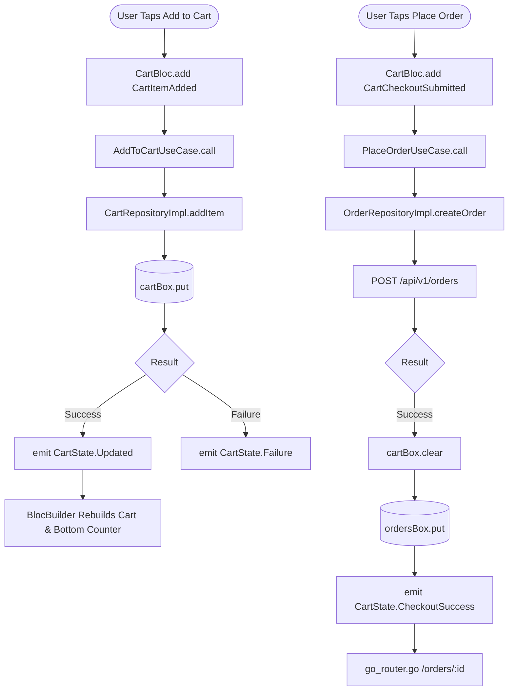

# Feature Development Plan — Cremen EatStreet Shop Application

**Source studied:**
- `https://cremeneatstreet.shop/` — Full content of Next.js production website (Menu: Mamara Bhel ₹40, Colegian Bhel ₹45, Special Cheese Bhel ₹60, Bombay Chinese Bhel ₹55, Dahi Puri ₹50, Batata Puri ₹45, Chat Papadi ₹55; Morning Specials: Rasawala Khaman ₹40, Aalupuri ₹45; Founder: Satyam Baranwal; Location: Surat, Gujarat; Phone: 8948998413).
- `.claude/commands/feature-flutter-plan.md` — Senior Flutter Architecture & Plan rules (Clean Architecture, flutter_bloc + freezed, Hive CE, go_router, get_it + injectable, platform-adaptive responsive UI).

---

### Step 1 — What is the feature

**a. High-level description**
The `cremen_eatstreet_shop_application` is a cross-platform mobile app (built with Flutter for iOS and Android) designed for **Cremen Eat Streets**, Surat's premier authentic street food cart owned by Satyam Baranwal. The application enables street food enthusiasts to seamlessly browse fresh menu offerings (Bhel, Puri, Chaat, and Morning Specials like Rasawala Khaman), customize dish spice levels and toppings, place pickup or delivery orders, track live preparation status in real-time, and receive push notifications. Additionally, it provides a dedicated Shopkeeper/Admin mode for Satyam Baranwal to manage incoming orders, menu availability, and store operations.

**b. Source citation**
> *"Cremen Eat Streets - Surat ka sabse swadist street food cart. Fresh bhel, puri, and chaat items. Owned by Satyam Baranwal. Order now for authentic flavors!"*
> *"Founder Satyam Baranwal ke netrutva mein, hum aapko authentic street food ka anubhav dete hain. Har dish fresh ingredients aur traditional recipes se banayi jati hai, jo aapke dil ko chhoo jayegi."*

**c. Status**
- **New** — Brand-new full-stack Flutter mobile application architecture.

---

### Step 2 — Screens

**a. List of screens**

1. `Splash / Onboarding` — "Branded welcome screen introducing Cremen Eat Streets Surat tagline, owner vision, and quick phone authentication."
   - Route path + name: `/onboarding`, `AppRoute.onboarding`
   - File path: [`lib/features/auth/presentation/screens/onboarding_screen.dart`](lib/features/auth/presentation/screens/onboarding_screen.dart)
   - Status: NEW
   - Bloc: `AuthBloc` ([`lib/features/auth/presentation/bloc/auth_bloc.dart`](lib/features/auth/presentation/bloc/auth_bloc.dart))
   - Responsive & Adaptive: `LayoutBuilder` scaling hero illustrations; Cupertino page route on iOS, Material fade on Android. Safe area padding for iOS Dynamic Island and Android gesture bar.
   - Tests: [`test/features/auth/presentation/screens/onboarding_screen_test.dart`](test/features/auth/presentation/screens/onboarding_screen_test.dart) (Widget & Golden tests).

2. `Home / Catalog` — "Main feed showcasing hero banner carousel, daily specials toggle (Morning Specials vs Evening Chaat), category filters, and popular items."
   - Route path + name: `/`, `AppRoute.home`
   - File path: [`lib/features/catalog/presentation/screens/home_screen.dart`](lib/features/catalog/presentation/screens/home_screen.dart)
   - Status: NEW
   - Bloc: `CatalogBloc` ([`lib/features/catalog/presentation/bloc/catalog_bloc.dart`](lib/features/catalog/presentation/bloc/catalog_bloc.dart))
   - Responsive & Adaptive: 2-column food grid on mobile (<600dp), 3-column grid on tablet/foldable (>=600dp). iOS Cupertino sliver nav bar with pull-to-refresh; Android Material 3 pull-to-refresh spinner.
   - Tests: [`test/features/catalog/presentation/screens/home_screen_test.dart`](test/features/catalog/presentation/screens/home_screen_test.dart) (Widget & Golden tests).

3. `Product Detail Modal` — "Bottom sheet/dialog displaying high-res item image, customization options (Spice level: Mild/Medium/Spicy, Extra Cheese, No Onion/Garlic), and quantity selector."
   - Route path + name: `/product/:id`, `AppRoute.productDetail`
   - File path: [`lib/features/catalog/presentation/screens/product_detail_screen.dart`](lib/features/catalog/presentation/screens/product_detail_screen.dart)
   - Status: NEW
   - Bloc: `CatalogBloc` ([`lib/features/catalog/presentation/bloc/catalog_bloc.dart`](lib/features/catalog/presentation/bloc/catalog_bloc.dart))
   - Responsive & Adaptive: DraggableScrollableSheet on phone; centered adaptive dialog on tablet. Haptic feedback on quantity tap (`HapticFeedback.lightImpact()`).
   - Tests: [`test/features/catalog/presentation/screens/product_detail_screen_test.dart`](test/features/catalog/presentation/screens/product_detail_screen_test.dart).

4. `Cart & Checkout` — "Review selected street food items, select Order Type (Pickup at Cart / Delivery), apply coupon, and place order."
   - Route path + name: `/cart`, `AppRoute.cart`
   - File path: [`lib/features/cart/presentation/screens/cart_screen.dart`](lib/features/cart/presentation/screens/cart_screen.dart)
   - Status: NEW
   - Bloc: `CartBloc` ([`lib/features/cart/presentation/bloc/cart_bloc.dart`](lib/features/cart/presentation/bloc/cart_bloc.dart))
   - Responsive & Adaptive: Sticky bottom CTA bar respecting system bottom inset. iOS Action Sheet for payment method; Android Material Radio group.
   - Tests: [`test/features/cart/presentation/screens/cart_screen_test.dart`](test/features/cart/presentation/screens/cart_screen_test.dart) (Widget & Golden tests).

5. `Order Live Tracking` — "Real-time order progress timeline (Received -> Bawarchi Preparing -> Ready for Pickup / Out for Delivery) with direct call button to Satyam Baranwal."
   - Route path + name: `/orders/:id`, `AppRoute.orderTracking`
   - File path: [`lib/features/orders/presentation/screens/order_tracking_screen.dart`](lib/features/orders/presentation/screens/order_tracking_screen.dart)
   - Status: NEW
   - Bloc: `OrderBloc` ([`lib/features/orders/presentation/bloc/order_bloc.dart`](lib/features/orders/presentation/bloc/order_bloc.dart))
   - Responsive & Adaptive: Animated stepper widget using implicit animations. Tap-to-call direct `tel:8948998413` native integration.
   - Tests: [`test/features/orders/presentation/screens/order_tracking_screen_test.dart`](test/features/orders/presentation/screens/order_tracking_screen_test.dart).

6. `Order History` — "List of user's past street food orders with re-order button and invoice details."
   - Route path + name: `/orders`, `AppRoute.orderHistory`
   - File path: [`lib/features/orders/presentation/screens/order_history_screen.dart`](lib/features/orders/presentation/screens/order_history_screen.dart)
   - Status: NEW
   - Bloc: `OrderBloc` ([`lib/features/orders/presentation/bloc/order_bloc.dart`](lib/features/orders/presentation/bloc/order_bloc.dart))
   - Responsive & Adaptive: Card list layout with smooth dismissal / pull-to-refresh.
   - Tests: [`test/features/orders/presentation/screens/order_history_screen_test.dart`](test/features/orders/presentation/screens/order_history_screen_test.dart).

7. `Shopkeeper Admin Dashboard` — "Internal order management screen for Satyam Baranwal to view live orders, tap to update status ('Preparing', 'Ready'), and toggle menu availability."
   - Route path + name: `/admin/dashboard`, `AppRoute.adminDashboard`
   - File path: [`lib/features/admin/presentation/screens/admin_dashboard_screen.dart`](lib/features/admin/presentation/screens/admin_dashboard_screen.dart)
   - Status: NEW
   - Bloc: `AdminOrderBloc` ([`lib/features/admin/presentation/bloc/admin_order_bloc.dart`](lib/features/admin/presentation/bloc/admin_order_bloc.dart))
   - Responsive & Adaptive: Kanban board view on desktop/tablet, tabbed list on phone. Audio alert on new incoming order.
   - Tests: [`test/features/admin/presentation/screens/admin_dashboard_screen_test.dart`](test/features/admin/presentation/screens/admin_dashboard_screen_test.dart).

**b. Screen → design-source mapping table**

| Screen | Design source | Section / task | Copy strings to use verbatim |
| --- | --- | --- | --- |
| `Onboarding` | `https://cremeneatstreet.shop/` | Hero Header | "Cremen Eat Streets", "Surat ka Sabse Swadist Street Food", "Founder Satyam Baranwal ke netrutva mein..." |
| `Home` | `https://cremeneatstreet.shop/` | Menu Section | "Our Delicious Menu", "Morning Special Menu", "Mamara Bhel", "Colegian Bhel", "Special Cheese Bhel", "Bombay Chinese Bhel", "Dahi Puri", "Batata Puri", "Chat Papadi", "Rasawala Khaman", "Aalupuri" |
| `Product Detail` | `https://cremeneatstreet.shop/` | Menu Card | "Crispy puffed rice mixed with tangy tamarind chutney...", "🔥 Spicy", "Morning Special", "Extra Cheese" |
| `Cart` | `https://cremeneatstreet.shop/` | Order CTA | "View Menu", "Order Now", "Pickup at Cart", "Direct Delivery in Surat" |
| `Order Live Tracking` | `https://cremeneatstreet.shop/` | Cooking Animation | "Creating Magic...", "Our Bawarchi is crafting your perfect bhel with fresh ingredients!", "Call Satyam Baranwal: 8948998413" |
| `Admin Dashboard` | `https://cremeneatstreet.shop/` | Owner Portal | "Surat EatStreet Kitchen Queue", "Accept Order", "Mark Ready", "Out for Delivery" |

---

### Step 3 — User Journey (Mermaid)

```mermaid
flowchart LR
    A[Open App] --> B[Splash & Onboarding]
    B --> C{Authenticated?}
    C -- No --> D[Phone OTP Login]
    C -- Yes --> E[Home Menu Screen]
    D --> E
    E --> F[Select Category / Morning Special]
    F --> G[Open Product Customization Modal]
    G --> H[Add to Cart]
    H --> I[Review Cart & Select Pickup/Delivery]
    I --> J[Place Order]
    J --> K[Order Live Tracking Screen]
    K --> L[Receive Push Notification: Order Ready!]
    
    subgraph Admin Flow (Satyam Baranwal)
        M[Admin Login] --> N[Admin Dashboard]
        N --> O[Incoming Order Notification]
        O --> P[Update Status: Preparing -> Ready]
        P --> K
    end
```

---

### Step 4 — Data layer schema

**a. New Hive models**

### [`lib/features/catalog/data/models/product_model.dart`](lib/features/catalog/data/models/product_model.dart)
| Field | Type | Constraints | Purpose |
| --- | --- | --- | --- |
| `id` | `String` | required, `@HiveField(0)` | Product ID |
| `name` | `String` | required, `@HiveField(1)` | e.g. "Mamara Bhel" |
| `description` | `String` | required, `@HiveField(2)` | Item description |
| `price` | `double` | required, `@HiveField(3)` | Price in INR (₹) |
| `imageUrl` | `String` | required, `@HiveField(4)` | Asset/Network image path |
| `category` | `String` | required, `@HiveField(5)` | "bhel", "puri", "morning_special" |
| `isSpicy` | `bool` | required, `@HiveField(6)` | Spicy badge flag |
| `isMorningSpecial`| `bool` | required, `@HiveField(7)` | Available in morning only |

### [`lib/features/cart/data/models/cart_item_model.dart`](lib/features/cart/data/models/cart_item_model.dart)
| Field | Type | Constraints | Purpose |
| --- | --- | --- | --- |
| `id` | `String` | required, `@HiveField(0)` | Line item unique ID |
| `productId` | `String` | required, `@HiveField(1)` | Refers to ProductModel.id |
| `productName` | `String` | required, `@HiveField(2)` | Display title |
| `unitPrice` | `double` | required, `@HiveField(3)` | Base price |
| `quantity` | `int` | >= 1, `@HiveField(4)` | Quantity count |
| `spiceLevel` | `String` | required, `@HiveField(5)` | "Mild", "Medium", "Spicy" |
| `hasExtraCheese` | `bool` | `@HiveField(6)` | Addon flag (+₹15) |
| `specialInstructions`|`String`| `@HiveField(7)` | "No onions", etc. |

### [`lib/features/orders/data/models/order_model.dart`](lib/features/orders/data/models/order_model.dart)
| Field | Type | Constraints | Purpose |
| --- | --- | --- | --- |
| `id` | `String` | required, `@HiveField(0)` | Order tracking ID |
| `itemsJson` | `String` | required, `@HiveField(1)` | Serialized cart items |
| `totalAmount` | `double` | required, `@HiveField(2)` | Total invoice price |
| `status` | `String` | required, `@HiveField(3)` | "received", "preparing", "ready" |
| `orderType` | `String` | required, `@HiveField(4)` | "pickup", "delivery" |
| `createdAt` | `DateTime` | required, `@HiveField(5)` | Order timestamp |

**b. Hive Type ID Registry (`lib/core/storage/hive_type_ids.dart`)**
- `ProductModel`: `typeId = 1`
- `CartItemModel`: `typeId = 2`
- `OrderModel`: `typeId = 3`

**c. Domain Entities**
- `Product` ([`lib/features/catalog/domain/entities/product.dart`](lib/features/catalog/domain/entities/product.dart))
- `CartItem` ([`lib/features/cart/domain/entities/cart_item.dart`](lib/features/cart/domain/entities/cart_item.dart))
- `Order` ([`lib/features/orders/domain/entities/order.dart`](lib/features/orders/domain/entities/order.dart))

**d. Box Registration & Storage**
- `productsBox`: Unencrypted, local catalog caching.
- `cartBox`: Unencrypted, persistent shopping cart.
- `ordersBox`: Encrypted via `flutter_secure_storage` key, storing customer purchase history.

**e. Caching Strategy**
- **Catalog**: *Stale-while-revalidate* — Display cached menu instantly from Hive, refresh from remote API in background.
- **Cart**: *Cache-first* — Immediate local write to `cartBox`; synced on checkout.
- **Orders**: *Network-first* — Always fetch live order state via API, cache response in `ordersBox` for offline viewing.

**f. Migration Plan**
- Hive additive fields use `@HiveField(..., defaultValue: ...)` annotations. No breaking box schema changes planned for v1.

---

### Step 5 — State management design (BLoC)

**a. New Blocs (All using `freezed` sealed union states)**

1. `CatalogBloc` ([`lib/features/catalog/presentation/bloc/catalog_bloc.dart`](lib/features/catalog/presentation/bloc/catalog_bloc.dart))
   - Events: `CatalogStarted`, `CatalogCategorySelected`, `CatalogSearchQueryChanged`
   - States: `Initial`, `Loading`, `Success(List<Product> products, String selectedCategory)`, `Failure(String message)`
   - Use cases: `GetCatalogUseCase`

2. `CartBloc` ([`lib/features/cart/presentation/bloc/cart_bloc.dart`](lib/features/cart/presentation/bloc/cart_bloc.dart))
   - Events: `CartItemAdded(CartItem item)`, `CartItemRemoved(String id)`, `CartItemQuantityUpdated(String id, int delta)`, `CartCleared`
   - States: `Initial`, `Updated(List<CartItem> items, double totalAmount)`, `CheckoutInProgress`, `CheckoutSuccess(Order order)`, `Failure(String message)`
   - Use cases: `AddToCartUseCase`, `GetCartUseCase`, `PlaceOrderUseCase`

3. `OrderBloc` ([`lib/features/orders/presentation/bloc/order_bloc.dart`](lib/features/orders/presentation/bloc/order_bloc.dart))
   - Events: `OrderFetchRequested(String id)`, `OrderHistoryRequested`, `OrderStatusStreamSubscribed`
   - States: `Initial`, `Loading`, `Loaded(Order order)`, `HistoryLoaded(List<Order> orders)`, `Failure(String message)`
   - Use cases: `GetOrderDetailsUseCase`, `GetOrderHistoryUseCase`

4. `AdminOrderBloc` ([`lib/features/admin/presentation/bloc/admin_order_bloc.dart`](lib/features/admin/presentation/bloc/admin_order_bloc.dart))
   - Events: `AdminOrdersSubscribed`, `AdminOrderStatusChanged(String orderId, String newStatus)`
   - States: `Initial`, `Loading`, `ActiveOrdersLoaded(List<Order> orders)`, `Failure(String message)`
   - Use cases: `UpdateOrderStatusUseCase`, `GetActiveOrdersUseCase`

**b. Route Guard Application (`lib/core/router/app_router.dart`)**
- Protected routes `/cart`, `/checkout`, `/orders`, `/admin/dashboard` check session state in `AuthBloc`. Unauthenticated users are redirected to `/onboarding` with a return route query param.

**c. Cross-cutting Concerns**
- Top-level `MultiBlocListener` in `main.dart` wraps `MaterialApp.router` to handle global error snackbars (`CartBloc` / `OrderBloc` failures), push notification navigation, and network connectivity banners.

---

### Step 6 — Routes

**a. App Routes (go_router)**

```
/onboarding               — "Onboarding & OTP Login"      [public]                              NEW
/                         — "Home Catalog Feed"           [public]                              NEW
/product/:id              — "Product Customization"       [public]                              NEW
/cart                     — "Review Shopping Cart"        [protected: authGuard redirect]       NEW
/checkout                 — "Order Checkout"              [protected: authGuard redirect]       NEW
/orders                   — "Order History"               [protected: authGuard redirect]       NEW
/orders/:id               — "Live Order Tracking"         [protected: authGuard redirect]       NEW
/admin/dashboard          — "Shopkeeper Order Console"    [protected: adminGuard redirect]      NEW
```

**b. API Endpoints Consumed**

```
GET    /api/v1/menu                — Fetch street food catalog       [public]               NEW
GET    /api/v1/menu/specials       — Fetch morning specials          [public]               NEW
POST   /api/v1/auth/otp/send       — Send phone OTP                  [public]               NEW
POST   /api/v1/auth/otp/verify     — Verify OTP & return JWT token   [public]               NEW
POST   /api/v1/orders              — Place new food order            [auth: Bearer token]   NEW
GET    /api/v1/orders/user         — List past user orders           [auth: Bearer token]   NEW
GET    /api/v1/orders/{id}         — Fetch order live status         [auth: Bearer token]   NEW
PATCH  /api/v1/admin/orders/{id}   — Update status (Admin Satyam)    [auth: Admin token]    NEW
POST   /api/v1/devices/register    — Register FCM token for push     [auth: Bearer token]   NEW
```

---

### Step 7 — Widgets

**a. New Widgets**

1. `FoodCard` ([`lib/core/widgets/food_card.dart`](lib/core/widgets/food_card.dart)) — Shared food item card with glassmorphism styling, price tag, spicy badge, and "Add" button.
2. `CategoryChip` ([`lib/core/widgets/category_chip.dart`](lib/core/widgets/category_chip.dart)) — Horizontal filter chip (Bhel, Puri, Chaat, Morning Special).
3. `QuantitySelector` ([`lib/core/widgets/quantity_selector.dart`](lib/core/widgets/quantity_selector.dart)) — Compact +/- increment button widget.
4. `StatusStepper` ([`lib/features/orders/presentation/widgets/status_stepper.dart`](lib/features/orders/presentation/widgets/status_stepper.dart)) — Custom visual step tracker for order preparation phases.
5. `GlassContainer` ([`lib/core/widgets/glass_container.dart`](lib/core/widgets/glass_container.dart)) — Shared `BackdropFilter` card wrapper used across screens.
6. `AppButton` ([`lib/core/widgets/app_button.dart`](lib/core/widgets/app_button.dart)) — Primary button with orange gradient and platform-adaptive ripple / feedback.

---

### Step 8 — Third-party integrations

**a. List of packages & SDKs**

### `firebase_messaging` & `flutter_local_notifications`
- Deliver real-time push notifications when Satyam Baranwal updates order status to "Ready for Pickup" or "Out for Delivery".
- New integration.
- Config: `google-services.json` (Android) and `GoogleService-Info.plist` (iOS) configured; env keys added to `.env.example`.

### `url_launcher`
- Enable direct tap-to-call Satyam Baranwal (`tel:8948998413`) or open food cart location in Google Maps.

### Firebase / Push Notification Deep-Dive:
1. **Background Handler**: Registered with `@pragma('vm:entry-point') Future<void> _firebaseMessagingBackgroundHandler(RemoteMessage message)` in [`lib/core/notifications/fcm_background_handler.dart`](lib/core/notifications/fcm_background_handler.dart).
2. **Service Placement**: Initialized in [`lib/core/notifications/notification_service.dart`](lib/core/notifications/notification_service.dart) before `runApp()`.
3. **Token Sync Flow**: `FirebaseMessaging.instance.getToken()` syncs to `POST /api/v1/devices/register`.
4. **Foreground Display**: `flutter_local_notifications` displays heads-up banners when app is active.
5. **Permission UX**: iOS & Android 13+ permission request managed via `AuthBloc` state.
6. **Deep Link on Tap**: Tapping order notification deep links directly to `/orders/:id` via `go_router`.

---

### Step 9 — End-to-end Mermaid flow (technical)



---

### Step 10 — Bloc event handlers & per-handler logic

### `CartBloc` — `on<CartItemAdded>`
1. Validate item quantity and price.
2. Call `AddToCartUseCase(item)` which invokes `CartRepository.addItem()`.
3. Repository performs local write to `cartBox`. Returns `Result<CartItem>`.
4. On `Success`: Calculates updated total amount; emits `CartState.Updated(items, newTotal)`.
5. On `Failure`: Emits `CartState.Failure("Could not add item to cart")`.

### `CartBloc` — `on<CartCheckoutSubmitted>`
1. Emit `CartState.CheckoutInProgress()`.
2. Retrieve current cart items from `cartBox`.
3. Call `PlaceOrderUseCase(cartItems, orderType)`.
4. `OrderRepositoryImpl` executes `POST /api/v1/orders` via Dio client.
5. If remote call succeeds: Clear local `cartBox`, cache order in `ordersBox`, return `Result.success(order)`.
6. Emit `CartState.CheckoutSuccess(order)`. Screen routes to `/orders/${order.id}`.
7. If remote call fails (e.g. network down): Map `DioException` to `NetworkFailure`. Emits `CartState.Failure("Network error. Please try again.")`.

---

### Step 11 — Output feature folder structure

```
lib/
├── core/
│   ├── di/
│   │   ├── injection.dart
│   │   └── injection.config.dart
│   ├── error/
│   │   ├── failure.dart
│   │   └── result.dart
│   ├── network/
│   │   └── dio_client.dart
│   ├── notifications/
│   │   ├── fcm_background_handler.dart
│   │   └── notification_service.dart
│   ├── router/
│   │   └── app_router.dart
│   ├── storage/
│   │   ├── hive_initializer.dart
│   │   └── hive_type_ids.dart
│   ├── theme/
│   │   ├── app_colors.dart
│   │   └── app_theme.dart
│   └── widgets/
│       ├── app_button.dart
│       ├── category_chip.dart
│       ├── food_card.dart
│       ├── glass_container.dart
│       └── quantity_selector.dart
├── features/
│   ├── admin/
│   │   ├── data/
│   │   │   ├── datasources/admin_remote_datasource.dart
│   │   │   └── repositories/admin_repository_impl.dart
│   │   ├── domain/
│   │   │   ├── repositories/admin_repository.dart
│   │   │   └── usecases/update_order_status_usecase.dart
│   │   └── presentation/
│   │       ├── bloc/
│   │       │   ├── admin_order_bloc.dart
│   │       │   ├── admin_order_event.dart
│   │       │   └── admin_order_state.dart
│   │       └── screens/admin_dashboard_screen.dart
│   ├── auth/
│   │   ├── data/...
│   │   ├── domain/...
│   │   └── presentation/
│   │       ├── bloc/auth_bloc.dart
│   │       └── screens/onboarding_screen.dart
│   ├── cart/
│   │   ├── data/
│   │   │   ├── datasources/cart_local_datasource.dart
│   │   │   ├── models/cart_item_model.dart
│   │   │   └── repositories/cart_repository_impl.dart
│   │   ├── domain/
│   │   │   ├── entities/cart_item.dart
│   │   │   ├── repositories/cart_repository.dart
│   │   │   └── usecases/add_to_cart_usecase.dart
│   │   └── presentation/
│   │       ├── bloc/
│   │       │   ├── cart_bloc.dart
│   │       │   ├── cart_event.dart
│   │       │   └── cart_state.dart
│   │       └── screens/cart_screen.dart
│   ├── catalog/
│   │   ├── data/
│   │   │   ├── datasources/catalog_remote_datasource.dart
│   │   │   ├── models/product_model.dart
│   │   │   └── repositories/catalog_repository_impl.dart
│   │   ├── domain/
│   │   │   ├── entities/product.dart
│   │   │   ├── repositories/catalog_repository.dart
│   │   │   └── usecases/get_catalog_usecase.dart
│   │   └── presentation/
│   │       ├── bloc/
│   │       │   ├── catalog_bloc.dart
│   │       │   ├── catalog_event.dart
│   │       │   └── catalog_state.dart
│   │       ├── screens/
│   │       │   ├── home_screen.dart
│   │       │   └── product_detail_screen.dart
│   │       └── widgets/menu_grid.dart
│   └── orders/
│       ├── data/
│       │   ├── datasources/order_remote_datasource.dart
│       │   ├── models/order_model.dart
│       │   └── repositories/order_repository_impl.dart
│       ├── domain/
│       │   ├── entities/order.dart
│       │   ├── repositories/order_repository.dart
│       │   └── usecases/place_order_usecase.dart
│       └── presentation/
│           ├── bloc/
│           │   ├── order_bloc.dart
│           │   ├── order_event.dart
│           │   └── order_state.dart
│           ├── screens/
│           │   ├── order_history_screen.dart
│           │   └── order_tracking_screen.dart
│           └── widgets/status_stepper.dart
```

**b. Test files**

```
test/
├── core/widgets/food_card_test.dart
├── features/cart/data/repositories/cart_repository_test.dart
├── features/cart/presentation/bloc/cart_bloc_test.dart
├── features/cart/presentation/screens/cart_screen_golden_test.dart
├── features/catalog/presentation/bloc/catalog_bloc_test.dart
├── features/catalog/presentation/screens/home_screen_golden_test.dart
└── features/orders/presentation/bloc/order_bloc_test.dart
```

**c. File-by-file delta table**

| # | Path | NEW / MODIFIED | Purpose | Est. LOC |
| --- | --- | --- | --- | --- |
| F1 | `lib/core/storage/hive_type_ids.dart` | NEW | Central typeId registry | 15 |
| F2 | `lib/core/storage/hive_initializer.dart` | NEW | Registers Hive adapters | 25 |
| F3 | `lib/core/error/result.dart` | NEW | Sealed Result<T> type | 30 |
| F4 | `lib/core/router/app_router.dart` | NEW | go_router & redirect guards | 85 |
| F5 | `lib/core/widgets/food_card.dart` | NEW | Reusable glass food card | 70 |
| F6 | `lib/core/widgets/app_button.dart` | NEW | Adaptive gradient button | 45 |
| F7 | `lib/features/catalog/domain/entities/product.dart` | NEW | Pure-Dart Product entity | 30 |
| F8 | `lib/features/catalog/data/models/product_model.dart` | NEW | Model + Hive adapter | 65 |
| F9 | `lib/features/catalog/presentation/bloc/catalog_bloc.dart` | NEW | Catalog BLoC | 95 |
| F10| `lib/features/catalog/presentation/screens/home_screen.dart` | NEW | Home Screen view shell | 30 |
| F11| `lib/features/cart/domain/entities/cart_item.dart` | NEW | Pure-Dart CartItem entity | 25 |
| F12| `lib/features/cart/data/models/cart_item_model.dart` | NEW | Model + Hive adapter | 55 |
| F13| `lib/features/cart/presentation/bloc/cart_bloc.dart` | NEW | Cart BLoC | 110 |
| F14| `lib/features/cart/presentation/screens/cart_screen.dart` | NEW | Cart Screen view shell | 30 |
| F15| `lib/features/orders/presentation/screens/order_tracking_screen.dart` | NEW | Live tracking view shell | 30 |
| F16| `lib/features/admin/presentation/screens/admin_dashboard_screen.dart` | NEW | Admin dashboard screen | 30 |
| F17| `test/features/catalog/presentation/screens/home_screen_golden_test.dart` | NEW | Golden tests (iOS & Android) | 50 |
| F18| `test/features/cart/presentation/bloc/cart_bloc_test.dart` | NEW | bloc_test event->state | 75 |
