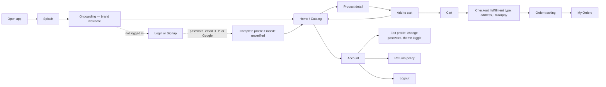
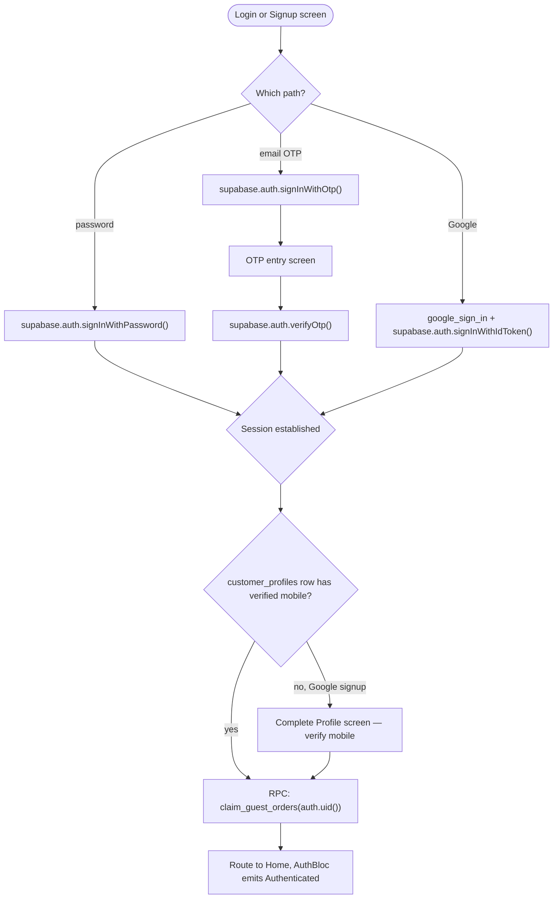
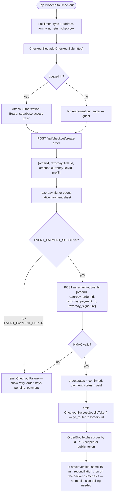

# Feature Development Plan — Cremen EatStreet Shop: Customer App Production Rebuild

Target: rebuild `cremen_eatstreet_shop_application` (currently an offline, single-device prototype — see [plan/whole-application-audit.md](plan/whole-application-audit.md)) into the **production, user-role-only** mobile client of the `cremen_eat_streets` web platform, wired to the same Supabase database and the same Razorpay account, ready for the App Store and Play Store. **The Owner/Admin console is dropped entirely** — this app is customer-facing only, matching the 15 customer pages of the website, not its 10 admin pages.

---

## Source studied

- [../cremen_eat_streets/plans/platform-overview.md](../cremen_eat_streets/plans/platform-overview.md) — the web platform's full architecture audit: 15 customer pages, Postgres schema + RLS policies, 5 API routes, third-party integrations (Razorpay, Supabase, email, SMS-stub, geocoding). This app's backend **is** that backend — no parallel API is being built except where noted "NEW — mobile backend work."
- [plan/whole-application-audit.md](plan/whole-application-audit.md) — this app's current state: 3 blocs, 10 screens, fully offline, no auth, hardcoded PIN admin gate, `Equatable` states, no DI, no typed Hive models, no tests worth the name. Every defect flagged there is either fixed by this rebuild or explicitly carried forward with a reason.
- [../cremen_eat_streets/app/api/checkout/create-order/route.js](../cremen_eat_streets/app/api/checkout/create-order/route.js) and [.../verify/route.js](../cremen_eat_streets/app/api/checkout/verify/route.js) — read in full to get exact request/response field names for Step 6b (below); confirms server-side re-pricing, `create_order` RPC, Razorpay order creation, and HMAC verification exactly as `platform-overview.md` describes.
- [../cremen_eat_streets/public/assets/images/logo.png](../cremen_eat_streets/public/assets/images/logo.png) — the only brand-mark asset found in the web repo: **192×192 PNG**. Flagged in the app-icon section below — too small for an iOS App Store master icon (needs 1024×1024).
- No `docs/`/`design/` folder exists in this repo either. Brand copy (name, tagline, contact info) is sourced from the `brand_settings` table (documented in `platform-overview.md` Step 4a) rather than hardcoded — see Step 4 for why that itself is a rebuild goal, not just a copy source.

---

## Step 1 — What is the feature

**a. High-level description.** A native iOS/Android app for **Cremen Eat Streets** customers to browse the same product catalog as the website, sign up or log in (password, email OTP, or Google), add items to a cart, check out with Razorpay for shipping/local-delivery/pickup, track and review their orders, and manage their profile and app theme — all backed by the exact same Supabase database and Razorpay account the website uses, so an order placed in the app and an order placed on the website show up in the same admin dashboard and the same customer's "My Orders" either way.

**b. Source citation.**
> *"Customers browse a product catalog (packaged snacks and fresh food), add items to a cart, and check out via Razorpay for either home shipping, local delivery (Surat only), or pickup. They can check out as a guest or log in first (password, email OTP, or Google). Logged-in customers get an order history, can review delivered items, and manage their profile."* — [platform-overview.md](../cremen_eat_streets/plans/platform-overview.md), Step 1a.

**c. Status: New (rebuild).** Nothing about auth, payment, or remote data exists in the current codebase today (per the audit). Every screen that already exists in polished form (Splash, Home/Catalog, Product Detail, Cart, Order Tracking, Order History) is **kept and modified**, not thrown away — its UI/animation work is real and reusable; only its data layer changes from "local Hive only" to "Supabase + Hive cache."

---

## Step 2 — Screens

**a. Screen inventory** — 16 screens: 6 kept-and-modified from the current app, 10 new, 0 admin (removed).

| Screen | Route + name | File | Status | Bloc | Web page mirrored |
|---|---|---|---|---|---|
| Splash | `/splash` | [lib/features/splash/presentation/screens/splash_screen.dart](lib/features/splash/presentation/screens/splash_screen.dart) | MODIFIED — logo now loaded from `brand_settings.logo_media_path` with the bundled asset as fallback; kicks off session-restore + `brand_settings` fetch during the animation instead of a flat timer | none (reads `AuthBloc`/`BrandCubit` state to decide where to route next) | N/A (mobile-only) |
| Onboarding (brand intro) | `/onboarding` | [lib/features/auth/presentation/screens/onboarding_screen.dart](lib/features/auth/presentation/screens/onboarding_screen.dart) | MODIFIED — **Owner Console entry point deleted entirely**; CTAs become "Explore Menu" (guest) and "Login / Sign Up" | none | Home (`/`) hero section |
| Login | `/login` | `lib/features/auth/presentation/screens/login_screen.dart` | NEW | `AuthBloc` | `/login` |
| Signup | `/signup` | `lib/features/auth/presentation/screens/signup_screen.dart` | NEW | `AuthBloc` | `/signup` |
| Email OTP entry | `/login/otp`, `/signup/otp` | `lib/features/auth/presentation/screens/otp_screen.dart` | NEW — shared by login-via-OTP and signup-mobile-verify | `AuthBloc` | inline OTP step on web's login/signup pages |
| Forgot password | `/forgot-password` | `lib/features/auth/presentation/screens/forgot_password_screen.dart` | NEW | `AuthBloc` | `/forgot-password` |
| Reset password | `/reset-password` | `lib/features/auth/presentation/screens/reset_password_screen.dart` | NEW — opened via the Supabase recovery deep link | `AuthBloc` | `/reset-password` |
| Complete profile | `/complete-profile` | `lib/features/auth/presentation/screens/complete_profile_screen.dart` | NEW — gate for Google sign-ins missing a verified mobile number | `AuthBloc` | `/complete-profile` |
| Home / Catalog | `/` | [lib/features/catalog/presentation/screens/home_screen.dart](lib/features/catalog/presentation/screens/home_screen.dart) | MODIFIED — `CatalogBloc` now hits Supabase (`products` + `product_media`, `status='active'`) with a Hive stale-while-revalidate cache instead of `ProductData.sampleProducts`; **merges the web's separate Home (`/`) and Shop (`/shop`) into one screen** (deliberate mobile-UX consolidation, not a gap — noted explicitly so it isn't mistaken for a missed page) | `CatalogBloc` | `/` + `/shop` |
| Product Detail | pushed from Home grid (named route `productDetail`) | [lib/features/catalog/presentation/screens/product_detail_screen.dart](lib/features/catalog/presentation/screens/product_detail_screen.dart) | MODIFIED — adds a reviews list + "leave a review" form (only if the signed-in customer has a delivered order containing this product, mirroring the `product_reviews` RLS policy), adds `product_media` gallery instead of one `imageUrl`, adds Share (deep link to the same public product page on the website for SEO — see ASO section) | `CatalogBloc` (product+media) + new `ReviewsBloc` | `/shop/[slug]` |
| Cart | `/cart` (tab 1) | [lib/features/cart/presentation/screens/cart_screen.dart](lib/features/cart/presentation/screens/cart_screen.dart) | MODIFIED — **becomes review-only** (line items, quantity, subtotal, "Proceed to Checkout" CTA); the customer-details form and Place Order button move to the new Checkout screen, matching the web's `/cart` vs `/checkout` split | `CartBloc` | `/cart` |
| Checkout | pushed from Cart | `lib/features/checkout/presentation/screens/checkout_screen.dart` | NEW — fulfillment-type picker, address form + location-permission-driven autofill, Razorpay payment sheet | `CheckoutBloc` | `/checkout` |
| Order Tracking / Detail | `/orders/:id` | [lib/features/orders/presentation/screens/order_tracking_screen.dart](lib/features/orders/presentation/screens/order_tracking_screen.dart) | MODIFIED — reads from Supabase (`orders`+`order_items`+`order_status_history`, RLS-scoped) instead of local Hive; doubles as the "order detail" screen the web splits separately, since mobile doesn't need two screens for one order | `OrderBloc` | `/account/orders/[id]` + `/order/[publicToken]` (guest receipt, opened via deep link — see Step 8) |
| Order History | `/orders` (tab 2) | [lib/features/orders/presentation/screens/order_history_screen.dart](lib/features/orders/presentation/screens/order_history_screen.dart) | MODIFIED — Supabase-backed, RLS-scoped to `user_id = auth.uid()`; guest checkouts prompt "log in to see this order" instead of silently showing nothing | `OrderBloc` | `/account/orders` |
| Account / Profile | `/account` (tab 3) | `lib/features/profile/presentation/screens/account_screen.dart` | NEW — profile form, change password, **theme toggle (light/dark/system)**, logout, link to Returns Policy | `ProfileBloc` + `ThemeCubit` | `/account` |
| Returns Policy | pushed from Account | `lib/features/profile/presentation/screens/returns_policy_screen.dart` | NEW — static content, fetched from the same copy the website's `/policies/returns` page renders (or bundled as a constant if that copy is static markdown) | none | `/policies/returns` |

**Removed from the current app (Rule: this is a user-only app):** `AdminDashboardScreen`, `PinEntryScreen`, the Owner tab in the bottom bar, and every PIN-check code path — see Step 11 for the exact delete list. `ProductDetailModal` and `GlassContainer` (already dead per the audit) are deleted rather than carried forward.

**Responsive & platform-adaptive baseline (fixes the audit's Rule 8 findings):** every screen above uses `LayoutBuilder`-driven breakpoints (phone <600dp = 2-col grid, tablet/foldable ≥600dp = 3–4-col grid — the current dead `LayoutBuilder` in Home becomes a real one), is verified on both an iOS and an Android reference simulator before merge, and gets `.adaptive` widgets (`Switch.adaptive` for the theme toggle, platform `PageTransitionsTheme`) instead of the current single Material skin.

**b. Screen → source mapping**

| Screen | Design source | Copy / behavior to mirror |
|---|---|---|
| Login/Signup/OTP/Forgot/Reset/Complete-profile | `platform-overview.md` Step 5a, Step 2a rows for those 6 pages | Password + email-OTP + Google, exact same 3 auth paths; 30s OTP lifetime (`otp_verifications.expires_at`); 5-attempt/15-min lockout copy |
| Home/Catalog | `platform-overview.md` Step 2a (Home, Shop) | "packaged snacks and fresh food" categorization (`product_type` enum); active-only filter |
| Product Detail | `platform-overview.md` Step 4a (`products`, `product_reviews`) | Reviews gated to delivered orders only, same as web's RLS policy |
| Checkout | `platform-overview.md` Step 10 (`create-order` route steps 1–11) | Pickup / shipping / local-delivery (Surat-only) exactly as re-validated server-side; free-shipping threshold; no-return acknowledgment checkbox — **`noReturnAck` is a required field the web already enforces; the mobile checkout form must include the same checkbox, not skip it** |
| Order Tracking | `platform-overview.md` Step 4a (`order_status`enum: pending_payment→confirmed→processing→dispatched→delivered→cancelled) | Status stepper must use these 6 stages, not the current app's invented `received/preparing/ready/outForDelivery/completed` set |
| Returns Policy | `platform-overview.md` Step 2a | "No Returns/Refunds" static content |

---

## Step 3 — User Journey (Mermaid)



---

## Step 4 — Data layer schema

> This app has **two** data sources, and Step 4a/b below documents them separately rather than forcing one Hive-typed-model story onto both, per Rule 3's own allowance for a project's real conventions: **Supabase Postgres** is the source of truth for everything account-scoped (products, orders, reviews, profile); **Hive** is a local cache/offline layer only, plus the one thing that stays local-only by design — the cart, mirroring the web app's own `localStorage`-only cart (`platform-overview.md` Step 2a: *"cart state is `localStorage`-only"*).

**a. Remote schema (reused as-is — do not redefine it here)**

The Flutter app reads/writes the exact tables, columns, RLS policies, and Postgres functions already documented in [platform-overview.md](../cremen_eat_streets/plans/platform-overview.md) Step 4: `products`, `product_media`, `product_reviews`, `orders`, `order_items`, `order_status_history`, `customer_profiles`, `brand_settings`, plus the RPCs `create_order()`, `claim_guest_orders()`, `insert_product_media()` (not used by this app), `refresh_product_rating()` (trigger-only, never called directly by the client). No new tables, columns, or migrations are needed for the mobile app to function — this is purely a new client of an existing schema.

**Mobile-specific RLS implication to design around:** the customer-scoped policies (`orders` select, `order_items` select, `product_reviews` insert/update/delete, `customer_profiles` self read/update) all check `auth.uid()` — this works automatically the moment the Flutter app authenticates through the **same Supabase project** via `supabase_flutter`, because Postgrest evaluates RLS against the JWT the SDK attaches to every request. No mobile-specific RLS changes are needed.

**b. Local Hive cache — typed models this time (closes the audit's Rule 3 findings)**

```
### lib/core/storage/hive_type_ids.dart  (NEW — central registry, didn't exist before)
| typeId | Model               | Box            | Encrypted |
|--------|---------------------|-----------------|-----------|
| 1      | CachedProductModel  | products_cache | No — public catalog data |
| 2      | CartItemModel       | cart_box        | No — no PII, mirrors web's localStorage cart |
| 3      | CachedOrderModel    | orders_cache    | **Yes** — via flutter_secure_storage-sourced key (closes the audit's plaintext-PII finding) |
| 4      | SessionCacheModel   | session_box     | **Yes** — caches the Supabase refresh token for offline app-resume |
```

| Box | Purpose | Caching strategy |
|---|---|---|
| `products_cache` | Last-fetched product list + media, keyed by id | **Stale-while-revalidate** — render cached products instantly on Home open, then replace with a fresh Supabase fetch in the background; this is the one place the audit's "no remote datasource" gap gets closed |
| `cart_box` | Cart line items | **Cache-first, local-only, no server sync** — matches the web app's own `localStorage`-only cart exactly; there is no `cart` table on the backend, so this is not a gap to close, it's parity |
| `orders_cache` | Last-fetched order list, for offline viewing of order history | **Network-first** — always hit Supabase first (orders can change status from the admin side at any time); fall back to this cache only when offline |
| `session_box` | Supabase session (access/refresh token) | Written by `supabase_flutter`'s own persistence layer under the hood once configured with a `HiveLocalStorage`-equivalent adapter — see Step 8 |

**c. Migration plan.** N/A for the initial rebuild — every box above is new. The *existing* app's plaintext `cart_box`/`orders_box` (raw `Map<String, dynamic>`, per the audit) are deleted and replaced outright rather than migrated, since their data (a single test device's local cart/orders) has no server-side counterpart to reconcile against and isn't worth a migration script.

---

## Step 5 — State management design (BLoC)

> Every state below is a `freezed` sealed union (closes the audit's biggest Rule 2 finding — no more `Equatable`-only classes), every bloc is `@injectable` and resolved via `get_it` (closes the DI gap), and every bloc calls a repository/use case, never Hive/Supabase/Dio directly (closes the audit's "bloc calls `HiveStorageService` directly" finding).

**a. Blocs**

| Bloc | File | Key events | States | Use cases called |
|---|---|---|---|---|
| `AuthBloc` | `lib/features/auth/presentation/bloc/auth_bloc.dart` | `AuthSessionChecked`, `AuthLoggedInWithPassword`, `AuthOtpRequested`, `AuthOtpVerified`, `AuthGoogleSignInRequested`, `AuthPasswordResetRequested`, `AuthLoggedOut` | `Unauthenticated`, `AuthLoading`, `Authenticated(customerProfile)`, `NeedsProfileCompletion`, `AuthFailure(message)` | `LoginWithPasswordUseCase`, `RequestOtpUseCase`, `VerifyOtpUseCase`, `SignInWithGoogleUseCase`, `GetCurrentSessionUseCase`, `LogoutUseCase` |
| `CatalogBloc` | [lib/features/catalog/presentation/bloc/catalog_bloc.dart](lib/features/catalog/presentation/bloc/catalog_bloc.dart) | `CatalogRequested`, `CatalogCategorySelected`, `CatalogSearchQueryChanged`, `CatalogRefreshRequested` | `CatalogLoading`, `CatalogLoaded(products, selectedCategory, searchQuery, isRefreshing)`, `CatalogFailure(message)` | `GetCatalogUseCase` (stale-while-revalidate per Step 4b) |
| `ReviewsBloc` | `lib/features/catalog/presentation/bloc/reviews_bloc.dart` | `ReviewsRequested(productId)`, `ReviewSubmitted(rating, comment)` | `ReviewsLoading`, `ReviewsLoaded(reviews, canReview)`, `ReviewsFailure` | `GetProductReviewsUseCase`, `SubmitReviewUseCase` |
| `CartBloc` | [lib/features/cart/presentation/bloc/cart_bloc.dart](lib/features/cart/presentation/bloc/cart_bloc.dart) | `CartItemAdded`, `CartItemRemoved`, `CartItemQuantityChanged`, `CartCleared` | `CartState(items, status)` where `status` is `idle`/`persisting`/`persistFailed` (closes the audit's "no Failure variant" finding) | `AddToCartUseCase`, `RemoveFromCartUseCase`, `UpdateCartQuantityUseCase`, `ClearCartUseCase` — each wraps `CartLocalDataSource`, never Hive directly |
| `CheckoutBloc` | `lib/features/checkout/presentation/bloc/checkout_bloc.dart` | `FulfillmentTypeSelected`, `AddressSubmitted`, `NoReturnAcknowledged`, `CheckoutSubmitted`, `PaymentVerified`, `PaymentFailed` | `CheckoutIdle`, `CheckoutCreatingOrder`, `AwaitingPayment(razorpayOrderId, amount, keyId)`, `CheckoutSuccess(publicToken)`, `CheckoutFailure(message)` | `CreateOrderUseCase` (calls the existing `/api/checkout/create-order`), `VerifyPaymentUseCase` (calls `/api/checkout/verify`) |
| `OrderBloc` | [lib/features/orders/presentation/bloc/order_bloc.dart](lib/features/orders/presentation/bloc/order_bloc.dart) | `OrderHistoryRequested`, `OrderDetailRequested(id)`, `OrderReceiptRequested(publicToken)` | `OrdersLoading`, `OrdersLoaded(orders)`, `OrderDetailLoaded(order)`, `OrdersFailure(message)` | `GetOrderHistoryUseCase`, `GetOrderDetailUseCase`, `GetOrderByPublicTokenUseCase` |
| `ProfileBloc` | `lib/features/profile/presentation/bloc/profile_bloc.dart` | `ProfileRequested`, `ProfileUpdated`, `PasswordChanged` | `ProfileLoading`, `ProfileLoaded(profile)`, `ProfileFailure` | `GetProfileUseCase`, `UpdateProfileUseCase`, `ChangePasswordUseCase` |
| `ThemeCubit` | `lib/core/theme/theme_cubit.dart` | `ThemeModeChanged(mode)` | `ThemeState(mode)` — persisted to a small unencrypted Hive box, restored before `runApp()` | none — trivial local preference, correctly has no use case per Rule 2's own spirit (nothing to orchestrate) |
| `LocationCubit` | `lib/features/checkout/presentation/bloc/location_cubit.dart` | `LocationPermissionRequested`, `CurrentLocationRequested`, `AddressReverseGeocoded` | `LocationIdle`, `LocationPermissionDenied`, `LocationLoading`, `LocationResolved(address)`, `LocationFailure` | `RequestLocationPermissionUseCase`, `GetCurrentPositionUseCase`, `ReverseGeocodeUseCase` (calls the existing `/api/geocode/reverse`) |

**b. Route guard application.** A single `redirect:` callback in `lib/core/router/app_router.dart` reads `AuthBloc`'s current state (via `GoRouterRefreshStream` listening to the bloc, the standard go_router+bloc pattern) and:
- Redirects `/account`, `/account/orders*` to `/login` if `Unauthenticated`.
- Redirects to `/complete-profile` if `NeedsProfileCompletion`, from anywhere.
- Redirects `/login`, `/signup` away to `/` if already `Authenticated` (mirrors the web's self-redirect behavior per `platform-overview.md` Step 6a).
- `/`, `/cart`, `/checkout` (guest checkout allowed, per the web), and `/orders/:id` (public receipt path — see Step 8 deep-linking) stay public.

This directly closes the audit's single biggest finding (no `redirect:` guard existed at all, and the only "admin gate" was a hardcoded PIN) — there is no admin route left to guard in this app in the first place.

**c. Cross-cutting concerns.** A top-level `MultiBlocListener` wraps `MaterialApp.router` (in `main.dart`) for: a global error `SnackBar` on any bloc's `*Failure` state, a connectivity banner (`connectivity_plus`) since this app now makes real network calls, and Razorpay's own event callbacks (`EVENT_PAYMENT_SUCCESS`/`EVENT_PAYMENT_ERROR`/`EVENT_EXTERNAL_WALLET`) routed into `CheckoutBloc` events from `checkout_screen.dart` — Razorpay's SDK is not itself bloc-aware, so this one wiring point is unavoidably in the presentation layer, same as any platform-SDK callback.

---

## Step 6 — Routes

**a. App routes**

```
/splash                    — Splash                                          [public]                          MODIFIED
/onboarding                — Onboarding                                      [public]                          MODIFIED
/login                     — Login                                           [public, redirect if authed]      NEW
/login/otp                 — Email OTP entry (login)                        [public]                          NEW
/signup                    — Signup                                          [public, redirect if authed]      NEW
/signup/otp                — Email OTP entry (signup mobile verify)          [public]                          NEW
/forgot-password           — Forgot password                                 [public]                          NEW
/reset-password            — Reset password                                  [requires recovery session]       NEW
/complete-profile          — Complete profile                                [requires session]                NEW
/                          — Home / Catalog (tab 0)                          [public]                          MODIFIED
/product/:slug             — Product detail                                  [public]                          MODIFIED (named route — closes the audit's raw-Navigator.push finding)
/cart                      — Cart (tab 1)                                    [public]                          MODIFIED
/checkout                  — Checkout                                        [public — guest checkout allowed] NEW
/orders                    — Order history (tab 2)                           [protected: authGuard redirect]   MODIFIED
/orders/:id                — Order tracking/detail                           [public — public_token secures it, same as web] MODIFIED
/account                   — Account / Profile (tab 3)                       [protected: authGuard redirect]   NEW
/account/returns-policy    — Returns policy                                  [public]                          NEW
```

**Removed:** `/admin/dashboard` and every route/screen behind it — no admin surface exists in this app at all.

**b. API endpoints consumed**

```
### Direct Supabase Postgrest/Auth calls (via supabase_flutter — no custom backend route needed)
GET/POST  auth.*                          — signInWithPassword, signUp, signInWithOtp/verifyOtp, signInWithOAuth(google), resetPasswordForEmail, updateUser   EXISTING (Supabase Auth, reused as-is)
GET       products (+product_media)       — catalog, filtered status=active                                    EXISTING (RLS: public read active)
GET       product_reviews                 — by product_id                                                       EXISTING (RLS: public read)
POST/PATCH/DELETE product_reviews         — by the signed-in customer, RLS-gated to their own delivered orders  EXISTING
GET       orders (+order_items, +order_status_history) — by user_id = auth.uid(), or by id+public_token for the guest-receipt path EXISTING (RLS: customer read own)
GET/PATCH customer_profiles               — self read/update                                                    EXISTING (RLS: self read/update; protected columns still locked by the same trigger)
POST      rpc: claim_guest_orders(p_user_id) — called once right after any successful login/signup, exactly like the web does EXISTING

### Existing Next.js API routes (called as plain HTTPS JSON — same backend, same Razorpay account)
POST /api/checkout/create-order   — {items[{productId,quantity,variantLabel?}], customerName, customerEmail?, customerPhone, fulfillmentType, shippingAddress?, notes?, noReturnAck} → {orderId, razorpayOrderId, amount, currency, keyId, prefill}   EXISTING — see Finding below
POST /api/checkout/verify         — {orderId, razorpay_order_id, razorpay_payment_id, razorpay_signature} → {publicToken}         EXISTING, reusable as-is (HMAC is the guard, no session dependency)
GET  /api/geocode/reverse         — ?lat=&lon= → {line1, city, state, pincode, displayName}                                       EXISTING, reusable as-is (public, no auth)

### NEW backend work required (Next.js side, tracked here since "every API ready and tested" is in scope — not a Flutter-repo change)
```

**Finding — `create-order` currently can't attribute a mobile order to a logged-in customer.** [../cremen_eat_streets/app/api/checkout/create-order/route.js:20-22](../cremen_eat_streets/app/api/checkout/create-order/route.js#L20-L22) derives `userId` from `sessionClient.auth.getClaims()`, which reads the **cookie** on the incoming Next.js request — a Flutter app's plain HTTPS POST has no such cookie. Calling this route as-is from the mobile app today would silently create every order as a guest (`user_id = null`), even for a logged-in customer, relying entirely on `claim_guest_orders()` to backfill it later by email/phone match on next login — a degraded-but-not-broken fallback, not a crash. **Required backend change:** add a Bearer-token code path to `create-order` — accept `Authorization: Bearer <supabase access token>` and resolve `userId` via `supabase.auth.getUser(token)` when no cookie is present, falling back to the existing cookie path for the website unchanged. This is a small, additive change to one existing route, not a new schema or a new RLS policy.

---

## Step 7 — Widgets

**a. Reused as-is** (per Rule 4 — already correctly shared, no changes needed): [AppButton](lib/core/widgets/app_button.dart), [CategoryChip](lib/core/widgets/category_chip.dart), [QuantitySelector](lib/core/widgets/quantity_selector.dart).

**b. Modified:** [FoodCard](lib/core/widgets/food_card.dart) (image source becomes `product_media`'s primary image via `CachedNetworkImage`, not a raw URL string); [ResponsiveProductImage](lib/core/widgets/responsive_product_image.dart) (wraps `CachedNetworkImage` instead of bare `Image.network`, so catalog scrolling doesn't re-download images); [MainShellScreen](lib/core/widgets/main_shell_screen.dart) → renamed conceptually to the **"smart bottom bar"** the user asked for: 4 tabs (Home, Cart with a live item-count badge from `CartBloc`, Orders, Account), auto-hides on scroll-down and reappears on scroll-up (`NotificationListener<ScrollNotification>` + `AnimatedSlide`), and the 4th "Owner" tab is deleted.

**c. New shared widgets** (`lib/core/widgets/`): `EmptyStateView`, `ErrorStateView`, `LoadingSkeletonGrid` (uses `shimmer` — closes the audit's "bare `CircularProgressIndicator` in a blank Scaffold" Rule 8 finding, gives every screen a real designed loading state), `ThemeModeSwitch` (`Switch.adaptive`-based), `OtpInputBoxes`, `AddressFormFields`, `StarRatingInput`, `RazorpayPayButton`.

**d. Deleted** (per Rule 4 and this app's user-only scope): [BottomNavBar](lib/core/widgets/bottom_nav_bar.dart) (duplicate nav bar, per the audit), [GlassContainer](lib/core/widgets/glass_container.dart) (dead code, per the audit), [PinEntryScreen](lib/core/widgets/pin_entry_sheet.dart) (admin-only), [ProductDetailModal](lib/features/catalog/presentation/screens/product_detail_modal.dart) (dead code, per the audit).

---

## Step 8 — Third-party integrations

```
### supabase_flutter
- Auth (password, email OTP, Google OAuth), Postgrest reads/writes, session persistence
- New integration — same Supabase project URL/anon key as the website (NEXT_PUBLIC_SUPABASE_URL / NEXT_PUBLIC_SUPABASE_PUBLISHABLE_KEY, mapped to --dart-define SUPABASE_URL / SUPABASE_ANON_KEY, never a service-role key on-device)
- Platform config: Google OAuth needs the reversed-client-ID URL scheme in ios/Runner/Info.plist and the SHA-1 fingerprint registered in the Google Cloud console for Android; Supabase's redirect URL needs this app's custom scheme (e.g. cremeneatstreet://login-callback) added to Supabase Auth's allowed redirect list

### google_sign_in
- Google button on Login/Signup, paired with supabase_flutter's signInWithOAuth
- New integration — google-services.json (Android) / GoogleService-Info.plist-equivalent client ID (iOS), not committed with real values (Rule 14)

### razorpay_flutter
- Payment sheet on Checkout
- New integration — NEXT_PUBLIC_RAZORPAY_KEY_ID is the same publishable key the website uses (server keeps the secret); Android needs no manifest change, iOS needs no special capability

### geolocator + permission_handler
- "Use my current location" on Checkout's address form, reverse-geocoded via the existing /api/geocode/reverse
- New integration — NSLocationWhenInUseUsageDescription (iOS Info.plist) and no Android manifest entry needed beyond what permission_handler auto-merges; **designed denied-permission state required** (Rule 8) — Checkout must offer manual address entry if location is denied, never block checkout on it

### flutter_secure_storage
- Encryption key source for the orders_cache and session_box Hive boxes (Step 4b) — closes the audit's plaintext-PII finding
- New integration, no platform config beyond what the package auto-configures (Keychain on iOS, EncryptedSharedPreferences on Android)

### dio
- HTTP client for the 3 custom Next.js routes in Step 6b (create-order, verify, geocode/reverse) — Supabase calls go through supabase_flutter's own client, not Dio
- New integration — one shared instance in lib/core/network/dio_client.dart, base URL from --dart-define API_BASE_URL (the website's deployed domain)

### cached_network_image + shimmer
- Product/media images with disk caching; skeleton loading placeholders
- New integrations, no platform config

### get_it + injectable, freezed + json_serializable + build_runner (dev), bloc_test + mocktail (dev)
- DI container; sealed state unions + model (de)serialization; bloc/repository test tooling
- New integrations — closes the audit's Rule 2/5/12 findings; every new @injectable class triggers a build_runner regen (Rule 5)

### connectivity_plus
- Global offline banner (Step 5c)
- New integration
```

**8b. Animation & motion strategy — answering "best animation library" directly.** Keep [flutter_animate](https://pub.dev/packages/flutter_animate) for every micro-interaction already built and working (Splash particles, FoodCard press/shimmer, bottom-bar item selection) — it's already in `pubspec.yaml`, already used correctly, and rewriting those for a different library would be pure churn with no user-visible benefit. **Add** the official [`animations`](https://pub.dev/packages/animations) package for the two transitions `flutter_animate` isn't built for: a Material *container transform* from a `FoodCard` grid tile into `ProductDetailScreen` (the same visual language Flipkart/Amazon-style shopping apps use for list→detail), and a *shared axis* transition between the 4 bottom-bar tabs instead of the current instant `AnimatedSwitcher` cut. `Hero` (already used for the product image in `ProductDetailModal`, which is being deleted — re-apply the same `Hero` tag pattern to the new container-transform instead). No new animation package is needed beyond these two — a third library would be redundant given `flutter_animate` + `animations` already cover micro-interactions and route-level transitions respectively.

**8c. App icons, splash screen, and store readiness.**
- **Finding:** the only logo asset in the web repo, [logo.png](../cremen_eat_streets/public/assets/images/logo.png), is 192×192 — enough for an Android adaptive icon foreground but **below Apple's 1024×1024 App Store master-icon requirement**. Action needed before store submission: obtain or re-export a ≥1024×1024 source (check `brand_settings.mascot_media_path`/`logo_media_path` in Supabase Storage for a higher-res original, or ask design for one) before running icon generation.
- `flutter_launcher_icons` (dev dependency) generates all iOS/Android icon sizes from that one master image; `flutter_native_splash` generates the splash screen from the same logo + `brand_settings.color1` as the background color, keeping the native splash and the in-Flutter `SplashScreen` visually consistent instead of a jarring handoff.
- iOS: add `PrivacyInfo.xcprivacy` declaring the location and (if push is ever added later) notification permission reasons — required by Apple for any app requesting location as of the current App Store review guidelines.
- Play Store: the Data Safety form needs to declare **Location** (approximate, for delivery address), **Personal info** (name, email, phone, address — collected, linked to identity), and **Financial info** (handled entirely by Razorpay, not stored by this app — card/UPI details never touch app code or Supabase).
- App signing: standard `key.properties`/upload keystore for Android, standard App Store Connect provisioning for iOS — no project-specific deviation from Flutter's documented release process.

**8d. App Store Optimization (ASO) / discoverability — addressing the "so people searching Shop/Cart find this like Flipkart/Amazon" ask.** This is a native-app discovery problem, not web SEO — the equivalent levers are the store listing metadata and deep-linking, not `<meta>` tags:
- **App title** (30 chars, iOS) / **app name** (Play): `Cremen Eat Streets` — keep the brand name as the name; don't stuff keywords into the title itself, which both stores' review guidelines discourage and can flag as a title-keyword-stuffing violation.
- **iOS Subtitle** (30 chars): "Surat Street Food, Order Online" — this field *is* indexed for search, unlike the title.
- **iOS Keywords field** (100 chars, comma-separated, invisible to users): `street food,surat,bhel,puri,chaat,food order,snacks online,khaman,food delivery,pickup order`.
- **Play Store short description** (80 chars): "Order authentic Surat street food — bhel, puri, chaat — pickup or delivery."
- **Play Store long description**: lead with the same brand story already on the website (`platform-overview.md`'s quoted Home copy), naturally repeating "street food", "Surat", "order online", "pickup", "delivery" — Play's algorithm indexes the full long description, unlike iOS.
- **Category:** Food & Drink (both stores) — the category itself is a discovery signal Flipkart/Amazon don't compete in, so direct category-level competition with them isn't the right comparison; the actual competitors in this category are Zomato/Swiggy-style food-ordering apps, and the differentiator to lead with in the listing is "direct from the cart owner, no delivery-platform markup."
- **Deep linking (the one lever that's genuinely shared with web SEO):** configure Android App Links + iOS Universal Links for `https://cremeneatstreet.shop/shop/:slug` so a product link shared from the website (which already has Product/Breadcrumb JSON-LD per `platform-overview.md` Step 2a) opens directly in this app's `ProductDetailScreen` if installed — this is what actually lets the app "ride" the website's existing web SEO instead of starting from zero.

---

## Step 9 — End-to-end Mermaid flow (technical)

**Auth (all 3 paths converge on the same guest-order claim):**



**Checkout → Razorpay → order tracking:**



---

## Step 10 — Bloc event handlers and per-handler logic

```
### AuthBloc — on<AuthLoggedInWithPassword>
1. Call LoginWithPasswordUseCase(email, password) → AuthRepository.signInWithPassword().
2. Repository calls supabase.auth.signInWithPassword(); maps AuthException to a typed Failure (invalid credentials, rate-limited, network) — Result<Session>.
3. On Success: fetch customer_profiles row for this uid; if mobile_verified is false and auth_provider != 'password', emit NeedsProfileCompletion; else call claim_guest_orders RPC, then emit Authenticated(profile).
4. On Failure: emit AuthFailure(message) — never a raw AuthException reaching the UI.

### AuthBloc — on<AuthOtpVerified>
1. Call VerifyOtpUseCase(email, token) → supabase.auth.verifyOtp(type: OtpType.email).
2. Same post-success profile-check + claim_guest_orders sequence as password login.
3. On Failure (expired/wrong code): emit AuthFailure — OTP screen shows an inline error and a resend-countdown, mirroring the web's CountdownTimer component.

### CartBloc — on<CartItemAdded> (unchanged business logic from today's app; only the persistence path changes)
1. Merge-or-append into the in-memory list, same de-dupe key (product+variant+spice-equivalent options) as the current implementation.
2. emit CartState(items: updated, status: persisting).
3. Call AddToCartUseCase → CartLocalDataSource.save() (Hive, via the repository — no more direct HiveStorageService call from the bloc).
4. On Success: emit CartState(items: updated, status: idle).
5. On Failure (Hive write throws): emit CartState(items: updated, status: persistFailed) — UI still shows the optimistic update but surfaces a small inline "not saved" indicator instead of silently swallowing it (closes the audit's Rule 11 finding).

### CheckoutBloc — on<CheckoutSubmitted>
1. emit CheckoutCreatingOrder.
2. Call CreateOrderUseCase(cartItems, fulfillmentType, address, customerDetails, noReturnAck) → CheckoutRepository.createOrder(), which attaches the Bearer token from AuthBloc's current session if present (Step 6b's required backend change) and calls /api/checkout/create-order via Dio.
3. On 400 (validation): emit CheckoutFailure(server's error message verbatim — e.g. "Local delivery is only available within Surat...") so the user sees the exact same validation the website enforces.
4. On 200: emit AwaitingPayment(razorpayOrderId, amount, keyId) — screen opens the Razorpay sheet with this data.
5. Razorpay success callback → CheckoutBloc.add(PaymentVerified(razorpay_order_id, razorpay_payment_id, razorpay_signature)) → calls VerifyPaymentUseCase → /api/checkout/verify.
6. On verify success: CartBloc.add(CartCleared); emit CheckoutSuccess(publicToken).
7. On verify failure or Razorpay's own PaymentFailed event: emit CheckoutFailure — order remains pending_payment server-side; the existing 10-minute reconciliation cron (platform-overview.md Step 8) will catch a payment that actually succeeded on Razorpay's side but whose verify call never reached the app (e.g. app killed mid-flow), so this failure path does not need its own retry-polling logic on the mobile side.

### OrderBloc — on<OrderHistoryRequested>
1. emit OrdersLoading.
2. Call GetOrderHistoryUseCase → OrderRepository.getHistory(), which reads Supabase orders where user_id=auth.uid() (RLS enforces this even if the query were malformed) — Result<List<Order>>.
3. On Success: cache the list into orders_cache (Step 4b) and emit OrdersLoaded(orders).
4. On Failure (network down): fall back to orders_cache if non-empty, emit OrdersLoaded(cachedOrders) with a "showing offline data" flag on the state rather than a hard failure — otherwise emit OrdersFailure(message).
```

---

## Step 11 — Output feature folder structure

**a. Target tree**

```
lib/
├── main.dart                                     # MODIFIED — Supabase.initialize(), Hive typed adapters, get_it setup, ThemeCubit restore, before runApp()
├── core/
│   ├── di/injection.dart, injection.config.dart  # NEW
│   ├── error/failure.dart, result.dart           # NEW
│   ├── network/dio_client.dart                   # NEW — wraps the 3 custom API routes
│   ├── storage/hive_type_ids.dart, hive_initializer.dart   # NEW
│   ├── router/app_router.dart                    # MODIFIED — redirect: guard on AuthBloc, named productDetail route
│   ├── theme/{app_colors,app_theme,theme_cubit}.dart        # MODIFIED — theme_cubit.dart NEW
│   └── widgets/                                  # per Step 7 (adds EmptyStateView, ErrorStateView, LoadingSkeletonGrid, ThemeModeSwitch, etc.; deletes bottom_nav_bar.dart, glass_container.dart, pin_entry_sheet.dart)
└── features/
    ├── auth/
    │   ├── data/{datasources/auth_remote_datasource.dart, repositories/auth_repository_impl.dart}
    │   ├── domain/{entities/customer_profile.dart, repositories/auth_repository.dart, usecases/*.dart}
    │   └── presentation/{bloc/auth_*.dart, screens/*.dart}
    ├── catalog/                                   # MODIFIED — adds data/datasources/{catalog_remote_datasource,catalog_local_datasource}.dart, domain/repositories/catalog_repository.dart, domain/usecases/get_catalog_usecase.dart, data/repositories/catalog_repository_impl.dart
    │   └── presentation/bloc/reviews_bloc.dart, reviews_event.dart, reviews_state.dart   # NEW
    ├── cart/                                      # MODIFIED — adds data/{datasources/cart_local_datasource.dart, repositories/cart_repository_impl.dart}, domain/{repositories/cart_repository.dart, usecases/*.dart}
    ├── checkout/                                  # NEW — full data/domain/presentation per Rule 1
    ├── orders/                                    # MODIFIED — adds data/{datasources/order_remote_datasource.dart, repositories/order_repository_impl.dart}, domain/{repositories/order_repository.dart, usecases/*.dart}
    └── profile/                                   # NEW — full data/domain/presentation per Rule 1

DELETED:
lib/features/admin/**                              # entire feature — no admin surface in this app
lib/features/catalog/presentation/screens/product_detail_modal.dart
lib/core/widgets/bottom_nav_bar.dart
lib/core/widgets/glass_container.dart
lib/core/widgets/pin_entry_sheet.dart
```

**b. Test files** (closes the audit's Rule 12 gap — every bloc/repository this time, not 2 of 8)

```
test/features/auth/presentation/bloc/auth_bloc_test.dart              # bloc_test — all 3 login paths + failure paths
test/features/auth/data/repositories/auth_repository_test.dart        # mocktail
test/features/catalog/presentation/bloc/catalog_bloc_test.dart        # MODIFIED — now mocks the remote datasource instead of asserting on hardcoded data
test/features/cart/presentation/bloc/cart_bloc_test.dart              # MODIFIED — asserts the new persistFailed status path
test/features/checkout/presentation/bloc/checkout_bloc_test.dart      # NEW — the full create-order → Razorpay → verify sequence, mocked
test/features/orders/presentation/bloc/order_bloc_test.dart           # NEW — zero coverage today, per the audit
test/features/profile/presentation/bloc/profile_bloc_test.dart        # NEW
test/core/router/app_router_redirect_test.dart                        # NEW — proves the auth guard actually redirects
test/features/*/presentation/screens/*_golden_test.dart               # NEW — light/dark × iOS/Android for every screen with real UI
integration_test/checkout_flow_test.dart                              # NEW — end-to-end: login → browse → add to cart → checkout with Razorpay test-mode card → order tracking shows confirmed
```

**c. File-by-file delta table (highest-priority items — not exhaustive, see 11a for the full new-file list)**

| # | Path | NEW/MODIFIED | Purpose | Est. LOC |
|---|---|---|---|---|
| F1 | lib/core/di/injection.dart | NEW | get_it/injectable bootstrap | 40 |
| F2 | lib/core/network/dio_client.dart | NEW | Shared Dio for the 3 custom API routes | 40 |
| F3 | lib/features/auth/presentation/bloc/auth_bloc.dart | NEW | All 3 login paths + guest-claim orchestration | 140 |
| F4 | lib/features/checkout/presentation/bloc/checkout_bloc.dart | NEW | create-order → Razorpay → verify | 120 |
| F5 | lib/core/router/app_router.dart | MODIFIED | redirect: guard, named routes | +60 |
| F6 | lib/features/orders/data/repositories/order_repository_impl.dart | NEW | Supabase-backed, replaces HiveStorageService | 70 |
| F7 | ../cremen_eat_streets/app/api/checkout/create-order/route.js | MODIFIED (web repo) | Bearer-token userId resolution — see Step 6b Finding | +15 |
| F8 | test/features/checkout/presentation/bloc/checkout_bloc_test.dart | NEW | First-ever coverage of the money path | 90 |
| F9 | pubspec.yaml | MODIFIED | supabase_flutter, google_sign_in, razorpay_flutter, geolocator, permission_handler, flutter_secure_storage, dio, cached_network_image, shimmer, animations, get_it, injectable, freezed, json_serializable, connectivity_plus (deps); flutter_launcher_icons, flutter_native_splash, bloc_test, mocktail, build_runner (dev) | +30 |

---

**Decision confirmed:** the mobile order-status set is renamed to match the backend's real `order_status` enum exactly — `pendingPayment / confirmed / processing / dispatched / delivered / cancelled` — replacing the current app's invented `received/preparing/ready/outForDelivery/completed` set outright. No separate mobile-only status vocabulary and no label-mapping layer between them; the enum in [lib/features/orders/domain/entities/food_order.dart](lib/features/orders/domain/entities/food_order.dart) is edited in place to these 6 values, 1:1 with the Postgres enum, so a status change made from the admin dashboard shows up identically on mobile with no translation step to keep in sync. This only governs the *data model* — the stepper UI still renders human-readable copy per stage ("Payment pending", "Order confirmed", "Preparing", "Dispatched", "Delivered", "Cancelled"), it just derives that copy directly from the real enum value rather than from a second, hand-maintained status set.
