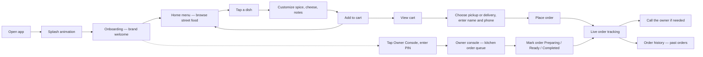

# Feature Development Plan — Whole Application Audit (`cremen_eatstreet_shop_application`)

This document audits **the entire Flutter application** as it exists on disk today — every screen, bloc, route, widget, storage box, and third-party integration — against the 11-step planning format and the 15 architecture rules in [.claude/commands/feature-flutter-plan.md](.claude/commands/feature-flutter-plan.md). It is written the way a senior/staff Flutter engineer would document a legacy codebase before the next sprint of work: what exists, what it actually does (not what a comment claims), and every place it deviates from the team's own conventions.

**Source studied:**
- [pubspec.yaml](pubspec.yaml) — confirms `flutter_bloc ^8.1.3`, `hive ^2.2.3` + `hive_flutter ^1.0.0` (classic Hive, not `hive_ce`), `go_router ^14.8.0`, `equatable ^2.0.7`, `google_fonts`, `flutter_animate`, `url_launcher`, `path_provider`, `cupertino_icons`, `intl`. **No** `get_it`, `injectable`, `freezed`, `json_serializable`, `dio`, `bloc_test`, `mocktail`, or `flutter_secure_storage`.
- [plan/cremen_eat_streets_app_plan.md](plan/cremen_eat_streets_app_plan.md) — the original business/technical vision doc: Razorpay payment gateway, `hive_generator`-based typed Hive models, live catalog scraped from `cremeneatstreet.shop`, `provider`/`flutter_bloc` for state.
- [plan/implementation_plan.md](plan/implementation_plan.md) — a prior `/feature-flutter-plan` run for this same app when it was **Status: New**. It specifies the *target* architecture (freezed blocs, `get_it`/`injectable`, typed `@HiveType` models, a `Result<T>`/`Failure` error pipeline, `AuthBloc` route guards, Firebase push, 9 REST endpoints) and quotes the verbatim copy sourced from `https://cremeneatstreet.shop/` (Founder: Satyam Baranwal, Surat, Gujarat, phone `8948998413`; menu items and prices). This document's Step 2b copy table is inherited from that source — it was not re-scraped live for this audit.
- No `docs/` or `design/` folder exists in the repository.
- Every file under [lib/](lib/) (36 Dart files across `core/` and 5 feature modules) and every file under [test/](test/) (7 files) was read in full before writing this audit — not sampled.

**How to read this document:** where the codebase matches the target architecture, it says so. Where it deviates, the deviation is called out explicitly as a **defect** (per the command's Rule 1 instruction to never wave off a violation as a "temporary shortcut"), with the exact rule it breaks and a concrete remediation in Step 11's delta table.

---

### Step 1 — What is the feature

**a. High-level description**

`cremen_eatstreet_shop_application` is a single-vendor food-ordering mobile app for **Cremen Eat Streets**, a street-food cart in Surat, Gujarat run by Satyam Baranwal. A customer opens the app, browses a fixed menu of bhel/puri/chaat/morning-special items, customizes spice level and add-ons, adds items to a cart, and places a pickup-or-delivery order by typing their name and phone number — there is no login, no payment gateway, and no backend server. The order is stored only on the customer's own device. A hidden "Owner Console" (unlocked by typing a fixed PIN shown on the entry screen itself) lets the shop owner see all orders ever placed on that device and advance each one through Received → Preparing → Ready → Completed.

**b. Source citation**

> *"Cremen Eat Streets - Surat ka sabse swadist street food cart... Founder Satyam Baranwal ke netrutva mein, hum aapko authentic street food ka anubhav dete hain."* — [plan/implementation_plan.md](plan/implementation_plan.md), Step 1b (originally sourced from `https://cremeneatstreet.shop/`)

**c. Status**

- **Partial / Built-with-major-deviations.** Every screen in the original plan has a working, polished UI (animations, light/dark theme, empty states). But the underlying architecture the team committed to in [plan/implementation_plan.md](plan/implementation_plan.md) — Clean Architecture layers, `freezed` states, `get_it`/`injectable` DI, typed Hive models with a `typeId` registry, a `Result<T>`/`Failure` error pipeline, router-level auth guards, a real backend, and payment/push integrations — was **not** implemented. What shipped is a simpler, entirely offline, single-developer prototype. This audit treats it as **Built** for UI/UX purposes and **New** for the architectural rules (1, 2, 3, 5, 6, 9, 11, 12, 13, 14), which still need to be done.

---

### Step 2 — Screens

**a. List of screens**

- `Splash` — "Animated brand intro shown for ~3.8s on app launch"
- `Onboarding` — "Brand welcome screen with 'Explore Menu' CTA and a hidden Owner Console entry point"
- `Home / Catalog` — "Search + category-filtered grid of the fixed menu, with a sticky bottom cart bar"
- `Product Detail Screen` — "Full-page item customization: spice level, extra cheese, instructions, quantity"
- `Product Detail Modal` — "Bottom-sheet variant of the same customization flow — **dead code, never navigated to**"
- `Cart & Checkout` — "Line-item review, order-type toggle, customer name/phone form, place-order CTA"
- `Order Tracking` — "3-step live status stepper for one order, plus a tap-to-call-owner button"
- `Order History` — "List of every order ever placed on this device"
- `Owner PIN Gate` — "6-digit PIN entry, shown either as a dialog (from Onboarding) or a full-screen overlay (from the shell's Owner tab)"
- `Admin Dashboard (Owner Console)` — "Kitchen queue: every order, with a status-changing popup menu"

| Screen | Route + name | File | New/Existing | Bloc | Responsive & platform-adaptive notes | Tests |
| --- | --- | --- | --- | --- | --- | --- |
| Splash | `/splash`, `splash` | [lib/features/splash/presentation/screens/splash_screen.dart](lib/features/splash/presentation/screens/splash_screen.dart) | EXISTING | none | Uses `MediaQuery.size` for particle bounds only; no breakpoint logic; single Material look on both platforms — **not verified on an iOS simulator, no Cupertino styling anywhere (Rule 8 gap)**. | None. |
| Onboarding | `/onboarding`, `onboarding` | [lib/features/auth/presentation/screens/onboarding_screen.dart](lib/features/auth/presentation/screens/onboarding_screen.dart) | EXISTING | none | `SingleChildScrollView` handles small phones; no tablet layout variant; PIN dialog is a stock Material `AlertDialog` on both platforms (no `CupertinoAlertDialog` branch). | [test/widget_test.dart](test/widget_test.dart) (smoke test only — checks two text strings render). |
| Home / Catalog | `/`, `home` | [lib/features/catalog/presentation/screens/home_screen.dart](lib/features/catalog/presentation/screens/home_screen.dart) | EXISTING | `CatalogBloc` + reads `CartBloc` | `GridView` hardcodes `crossAxisCount: 2` inside a `LayoutBuilder` whose `constraints` are never read — **dead responsive code, no tablet/foldable column count (Rule 8 gap)**. | None — no widget or golden test exists for the busiest screen in the app. |
| Product Detail Screen | pushed via `Navigator.push` (no named route — see Step 6a finding) | [lib/features/catalog/presentation/screens/product_detail_screen.dart](lib/features/catalog/presentation/screens/product_detail_screen.dart) | EXISTING | reads `CartBloc` | Fixed paddings/heights; own `BottomNavBar` instance duplicated from the shell (see Step 7b). | [test/features/catalog/presentation/screens/product_detail_screen_test.dart](test/features/catalog/presentation/screens/product_detail_screen_test.dart) (renders + back button only, no interaction/golden coverage). |
| Product Detail Modal | **unreachable** — no caller anywhere in [lib/](lib/) | [lib/features/catalog/presentation/screens/product_detail_modal.dart](lib/features/catalog/presentation/screens/product_detail_modal.dart) | EXISTING (dead) | reads `CartBloc` | N/A — never shown. | None. |
| Cart & Checkout | `/cart`, `cart` | [lib/features/cart/presentation/screens/cart_screen.dart](lib/features/cart/presentation/screens/cart_screen.dart) | EXISTING | `CartBloc` + writes `OrderBloc` | Single-column form works on phones; not tested on tablet width; no iOS action-sheet for order type (plain `ChoiceChip`s on both platforms). | None. |
| Order Tracking | `/orders/:id`, `orderTracking` | [lib/features/orders/presentation/screens/order_tracking_screen.dart](lib/features/orders/presentation/screens/order_tracking_screen.dart) | EXISTING | reads `OrderBloc` | Call button (`IconButton(Icons.phone_in_talk)`) has **no `Semantics`/tooltip label — Rule 8 accessibility gap**. | None. |
| Order History | `/orders`, `orderHistory` | [lib/features/orders/presentation/screens/order_history_screen.dart](lib/features/orders/presentation/screens/order_history_screen.dart) | EXISTING | reads `OrderBloc` | Plain `ListView.separated`; no pull-to-refresh (not needed — fully local data). | None. |
| Owner PIN Gate | pushed via `showDialog` (Onboarding) **and** `Navigator.push` (shell) — two separate implementations | [lib/features/auth/presentation/screens/onboarding_screen.dart](lib/features/auth/presentation/screens/onboarding_screen.dart) (dialog) / [lib/core/widgets/pin_entry_sheet.dart](lib/core/widgets/pin_entry_sheet.dart) (`PinEntryScreen`) | EXISTING (duplicated) | none | Fully custom animated background; not checked against Dynamic Island/gesture-nav insets. | [test/core/widgets/main_shell_test.dart](test/core/widgets/main_shell_test.dart) (taps through the shell's PIN entry, does not assert the PIN check itself). |
| Admin Dashboard | `/admin/dashboard`, `adminDashboard` | [lib/features/admin/presentation/screens/admin_dashboard_screen.dart](lib/features/admin/presentation/screens/admin_dashboard_screen.dart) | EXISTING | reads/writes `OrderBloc` (no dedicated `AdminOrderBloc` as originally planned) | Single-column order list; no Kanban/tablet layout as [plan/implementation_plan.md](plan/implementation_plan.md) Step 2a #7 specified. | None. |

**b. Screen → design-source mapping table**

| Screen | Design source | Section / task | Copy strings used verbatim |
| --- | --- | --- | --- |
| Onboarding | [plan/implementation_plan.md](plan/implementation_plan.md) | Step 2b, Hero Header | "Cremen Eat Streets", "Surat Ka Sabse Swadist Street Food Cart", "Founded by Satyam Baranwal" |
| Home / Catalog | [plan/implementation_plan.md](plan/implementation_plan.md) | Step 2b, Menu Section | "Mamara Bhel" ₹40, "Colegian Bhel" ₹45, "Special Cheese Bhel" ₹60, "Bombay Chinese Bhel" ₹55, "Dahi Puri" ₹50, "Batata Puri" ₹45, "Chat Papadi" ₹55, "Rasawala Khaman" ₹40, "Aalupuri" ₹45 — all present verbatim in [lib/features/catalog/data/models/product_data.dart](lib/features/catalog/data/models/product_data.dart) |
| Order Tracking | [plan/implementation_plan.md](plan/implementation_plan.md) | Step 2b, Cooking Animation | "Creating Magic...", "Call Satyam Baranwal: 8948998413" — phone number matches `tel:8948998413` hardcoded in [lib/features/orders/presentation/screens/order_tracking_screen.dart:17](lib/features/orders/presentation/screens/order_tracking_screen.dart#L17) |
| Admin Dashboard | [plan/implementation_plan.md](plan/implementation_plan.md) | Step 2b, Owner Portal | "Owner Console", implemented text differs slightly from the plan's "Surat EatStreet Kitchen Queue" — actual copy is "Kitchen Queue Empty" / "Owner mode active" |

---

### Step 3 — User Journey (Mermaid)



---

### Step 4 — Data layer schema

> **This whole section is the single biggest deviation from [plan/implementation_plan.md](plan/implementation_plan.md) Step 4 and from Rule 3.** The plan specified typed `@HiveType`/`@HiveField` models (`ProductModel`, `CartItemModel`, `OrderModel`) registered in a central `lib/core/storage/hive_type_ids.dart`. **None of that exists.** What was built instead is three plain-Dart entities that hand-roll their own `toMap()`/`fromMap()` and are stored as raw `Map<String, dynamic>` blobs in two `Hive.openBox<Map<String, dynamic>>()` boxes.

**a. Actual on-disk model** — there are no Hive-adapter model classes; the domain entities double as the persisted shape.

```
### lib/features/catalog/domain/entities/product.dart  (also the persisted shape)
| Field            | Type   | Constraints | Purpose                          |
|-------------------|--------|-------------|-----------------------------------|
| id                | String | required    | Stable item key                   |
| name              | String | required    | Display name                      |
| description       | String | required    | Menu card copy                    |
| price             | double | required    | Base price in ₹                   |
| imageUrl          | String | required    | Remote (unsplash) or asset path    |
| category          | String | required    | 'bhel' / 'puri' / 'chaat' / 'morning_special' |
| isSpicy           | bool   | required    | Spicy badge                        |
| isMorningSpecial  | bool   | required    | Morning-special badge              |

### lib/features/cart/domain/entities/cart_item.dart  (also the persisted shape)
| Field                 | Type    | Constraints        | Purpose                     |
|------------------------|---------|---------------------|-------------------------------|
| id                    | String  | required            | Line-item key (epoch-ms string) |
| product               | Product | required, nested map | Embedded full product        |
| quantity              | int     | required            | Line-item quantity            |
| spiceLevel            | String  | default 'Medium'   | 'Mild'/'Medium'/'Spicy'        |
| hasExtraCheese        | bool    | default false       | +₹15 addon flag                |
| specialInstructions   | String  | default ''          | Free-text note                 |

### lib/features/orders/domain/entities/food_order.dart  (also the persisted shape)
| Field            | Type            | Constraints | Purpose                         |
|-------------------|-----------------|-------------|-----------------------------------|
| id                | String          | required    | e.g. `ORD-<epoch tail>`           |
| items             | List<CartItem>  | required    | Nested line items                 |
| totalAmount       | double          | required    | Grand total incl. delivery fee    |
| status            | OrderStatus enum| required    | received/preparing/ready/outForDelivery/completed |
| orderType         | OrderType enum  | required    | pickup/delivery                    |
| createdAt         | DateTime        | required    | ISO-8601 string on disk            |
| customerName      | String          | required    | **PII**                            |
| customerPhone     | String          | required    | **PII**                            |
| deliveryAddress   | String?         | optional    | **PII**                            |
```

**b. Remote DTO** — none. There is no remote datasource anywhere in the app (no `Dio`, no `http` package). `ProductData.sampleProducts` in [lib/features/catalog/data/models/product_data.dart](lib/features/catalog/data/models/product_data.dart) is a hardcoded `const List<Product>` of 9 items compiled into the app binary — the "Catalog Ingestion" web-scraping step from [plan/cremen_eat_streets_app_plan.md](plan/cremen_eat_streets_app_plan.md) Phase 3 was never built.

**c. Domain entity** — [lib/features/catalog/domain/entities/product.dart](lib/features/catalog/domain/entities/product.dart), [lib/features/cart/domain/entities/cart_item.dart](lib/features/cart/domain/entities/cart_item.dart), [lib/features/orders/domain/entities/food_order.dart](lib/features/orders/domain/entities/food_order.dart) — all correctly free of `flutter`/Hive/Dio imports (Rule 1 domain-purity is respected here).

**d. Box registration** — both boxes are opened directly, repeatedly, and outside any `LocalDataSource` class, inside the shared static [lib/core/services/hive_storage_service.dart](lib/core/services/hive_storage_service.dart):
- `cart_box` — **unencrypted**. Holds product+cart data only; low sensitivity, acceptable.
- `orders_box` — **unencrypted**, but it stores `customerName`, `customerPhone`, and `deliveryAddress` (Step 4a). **Rule 3 defect: a PII-holding box must be encrypted via `flutter_secure_storage`; this one is plaintext.**
- There is no `lib/core/storage/hive_type_ids.dart`, so there is nothing to check for `typeId` collisions against — **Rule 3 defect**, and a blocker the moment a second Hive box is added by a different contributor.
- `HiveStorageService.saveCartItems`/`loadCartItems`/`saveOrders`/`loadOrders` are called **directly from the blocs** (`CartBloc`, `OrderBloc`), not from a per-feature `LocalDataSource` — **Rule 2 defect** ("Blocs never touch Hive... directly").

**e. Caching strategy** — there is no remote to reconcile against, so every model is effectively **cache-only** (Hive is the sole source of truth, hydrated once on bloc construction via `_hydrateFromStorage()` in both `CartBloc` and `OrderBloc`). This matches reality but not [plan/implementation_plan.md](plan/implementation_plan.md)'s planned stale-while-revalidate/network-first strategies, which assumed a backend that does not exist.

**f. Migration plan** — N/A today (additive-only so far, and no typed adapters to version). The moment typed Hive models are introduced to close the Rule 3 gap, the existing plaintext `Map` data in `cart_box`/`orders_box` will need a one-off read-old-map/write-new-adapter migration on first launch post-upgrade — call this out again when that work is scheduled.

---

### Step 5 — State management design (BLoC)

> **Rule 2 defect, app-wide:** every state class (`CartState`, `CatalogState` family, `OrderState`) extends `Equatable`, none use `freezed` sealed unions. `CatalogState` is closest to the target shape (`CatalogInitial`/`CatalogLoading`/`CatalogLoaded`/`CatalogError` as separate classes) but still hand-rolled, not a `freezed` union. `CartState` and `OrderState` are worse: each is a **single mutable-feeling class** with no `Initial`/`Loading`/`Failure` variants at all — a failed Hive write is currently unobservable by the UI.

**a. Existing blocs**

1. `CatalogBloc` — [lib/features/catalog/presentation/bloc/catalog_bloc.dart](lib/features/catalog/presentation/bloc/catalog_bloc.dart) / [catalog_event.dart](lib/features/catalog/presentation/bloc/catalog_event.dart) / [catalog_state.dart](lib/features/catalog/presentation/bloc/catalog_state.dart)
   - Events: `CatalogStarted`, `CatalogCategorySelected(category)`, `CatalogSearchQueryChanged(query)` — all correctly present-state-driven, though `CatalogStarted` isn't past-tense per Rule 2's naming convention (`<Subject><Noun><Verb>` implies past tense like `CatalogLoaded`/`CatalogRequested`).
   - States: `CatalogInitial`, `CatalogLoading`, `CatalogLoaded(products, selectedCategory, searchQuery)`, `CatalogError(message)`.
   - No use case — `CatalogStarted` handler directly emits `ProductData.sampleProducts` (Rule 2's "no direct Hive/Dio, go through use case" is trivially true only because there's nothing to call).
   - Applied on: Home / Catalog screen.
2. `CartBloc` — [lib/features/cart/presentation/bloc/cart_bloc.dart](lib/features/cart/presentation/bloc/cart_bloc.dart) / [cart_event.dart](lib/features/cart/presentation/bloc/cart_event.dart) / [cart_state.dart](lib/features/cart/presentation/bloc/cart_state.dart)
   - Events: `CartItemAdded(item)`, `CartItemRemoved(itemId)`, `CartItemQuantityChanged(itemId, delta)`, `CartCleared` — good past-tense naming.
   - State: single `CartState(items)` — **no `Failure` variant to surface a Hive write error to the user.**
   - Calls `HiveStorageService` directly (Step 4d defect).
   - Applied on: Home (add button), Product Detail Screen, Product Detail Modal (dead), Cart screen.
3. `OrderBloc` — [lib/features/orders/presentation/bloc/order_bloc.dart](lib/features/orders/presentation/bloc/order_bloc.dart) / [order_event.dart](lib/features/orders/presentation/bloc/order_event.dart) / [order_state.dart](lib/features/orders/presentation/bloc/order_state.dart)
   - Events: `OrderPlaced(order)`, `OrderStatusUpdated(orderId, newStatus)` — good past-tense naming.
   - State: single `OrderState(orders, activeOrder)` — same missing-`Failure`-variant defect as `CartBloc`.
   - Calls `HiveStorageService` directly (Step 4d defect).
   - Applied on: Cart (creates order), Order Tracking, Order History, Admin Dashboard.

**b. Missing blocs vs. the original plan**

- `AuthBloc` (planned in [plan/implementation_plan.md](plan/implementation_plan.md) Step 5a) — **not built.** Onboarding and the PIN gate are plain `StatefulWidget`s with local `TextEditingController` state; there is no session/auth state anywhere in the app.
- `AdminOrderBloc` (planned) — **not built**; `AdminDashboardScreen` reuses `OrderBloc` directly. This is a reasonable simplification given there's only one shared local order list, but it means Admin has no bloc of its own to reuse/modify — _Reuse as-is_: `OrderBloc`, because the dashboard only needs to read and update the same order list the customer side writes.

**c. Route guard application**

**There is no `redirect:` callback in [lib/core/router/app_router.dart](lib/core/router/app_router.dart) at all — Rule 6 defect, and the most consequential finding in this audit.** `/admin/dashboard` is a plain, unguarded `GoRoute`. The only thing standing between a customer and the owner console is:
1. A PIN dialog on the Onboarding screen ([lib/features/auth/presentation/screens/onboarding_screen.dart:39](lib/features/auth/presentation/screens/onboarding_screen.dart#L39)) whose `hintText` literally reads **"Default PIN: 123456"**, and
2. A near-identical, separately-implemented `PinEntryScreen` ([lib/core/widgets/pin_entry_sheet.dart](lib/core/widgets/pin_entry_sheet.dart)) reachable from the shell's 4th tab, which hardcodes the same check `if (pin == '123456')` at [line 72](lib/core/widgets/pin_entry_sheet.dart#L72).

Neither check is enforced by the router: **typing `/admin/dashboard` directly (trivial on the Flutter web build, or via any deep link) bypasses both PIN screens entirely**, because `go_router` has no `redirect:` reading any auth/session state to stop it. This also means the PIN logic is duplicated in two files (Rule 4/DRY defect) instead of centralized in one `redirect:` callback per Rule 6.

**d. Cross-cutting concerns**

- No global error snackbar/listener exists. [lib/main.dart](lib/main.dart) wraps `MaterialApp.router` in a plain `MultiBlocProvider` with no `MultiBlocListener` for cross-cutting concerns — there is currently nothing to listen for, since no bloc emits a `Failure` state (Step 5a).
- No connectivity banner — reasonable, since the app makes zero network calls today.

---

### Step 6 — Routes

**a. App routes** (from [lib/core/router/app_router.dart](lib/core/router/app_router.dart))

```
/splash                      — "Splash"                     [public]                 EXISTING
/onboarding                  — "Onboarding"                 [public]                 EXISTING
/                            — "Home (via MainShellScreen tab 0)"   [public]          EXISTING
/cart                        — "Cart (via MainShellScreen tab 1)"  [public]           EXISTING
/orders                      — "Order history (via MainShellScreen tab 2)" [public]   EXISTING
/orders/:id                  — "Order tracking"             [public]                 EXISTING
/admin/dashboard             — "Admin dashboard (via MainShellScreen tab 3)" [UNGUARDED — see Step 5c] EXISTING
```

Findings:
- Every route the plan called `[protected: authGuard redirect]` ([plan/implementation_plan.md](plan/implementation_plan.md) Step 6a: `/cart`, `/orders`, `/admin/dashboard`) is actually `[public]` in the shipped router — **Rule 6 defect**, consistent with Step 5c.
- **Product Detail has no named route at all.** [lib/features/catalog/presentation/screens/home_screen.dart:210](lib/features/catalog/presentation/screens/home_screen.dart#L210) opens it via a raw `Navigator.push(MaterialPageRoute(...))`, not `context.push(AppRoute.productDetail.name, ...)` — **Rule 6 defect** ("no raw... typed ad hoc elsewhere").
- `/`, `/cart`, `/orders`, and `/admin/dashboard` all route to the same `MainShellScreen` widget with a different `initialIndex` — this works, but the shell itself hand-rolls tab switching with local `State` + a `switch` in `_buildPage()` ([lib/core/widgets/main_shell_screen.dart:130](lib/core/widgets/main_shell_screen.dart#L130)) instead of go_router's `StatefulShellRoute` — **Rule 6 defect** ("use `ShellRoute`, not a hand-rolled... re-implementation").
- `/orders/:id` silently falls back to a hardcoded `'ORD-001'` if the `id` path parameter is somehow missing ([lib/core/router/app_router.dart:39](lib/core/router/app_router.dart#L39)) — masking, not surfacing, a routing bug.

**b. API endpoints consumed**

**None.** The app makes zero HTTP calls. `url_launcher` is used once, to open the device dialer (`tel:8948998413`), which is not an API call. Every one of the 9 REST endpoints planned in [plan/implementation_plan.md](plan/implementation_plan.md) Step 6b (`GET /api/v1/menu`, `POST /api/v1/orders`, `POST /api/v1/auth/otp/send`, etc.) is **N/A — not implemented; the app is fully offline/local-only today.**

---

### Step 7 — Widgets

**a. `lib/core/widgets/` inventory (all EXISTING, all correctly shared per Rule 4)**

| Widget | File | Reuse status |
| --- | --- | --- |
| `AppButton` | [lib/core/widgets/app_button.dart](lib/core/widgets/app_button.dart) | Reuse as-is — used on Onboarding, Cart, Product Detail (both variants), Order Tracking. |
| `BottomNavBar` | [lib/core/widgets/bottom_nav_bar.dart](lib/core/widgets/bottom_nav_bar.dart) | **See defect below** — only consumer is `ProductDetailScreen`. |
| `CategoryChip` | [lib/core/widgets/category_chip.dart](lib/core/widgets/category_chip.dart) | Reuse as-is — Home screen category filters. |
| `FoodCard` (+ private `_AddButton`) | [lib/core/widgets/food_card.dart](lib/core/widgets/food_card.dart) | Reuse as-is — Home screen grid. 306 lines / two widget classes in one file — borderline Rule 10 ("one widget per file"); `_AddButton` is private and tightly coupled, acceptable but worth a note if the file grows further. |
| `GlassContainer` | [lib/core/widgets/glass_container.dart](lib/core/widgets/glass_container.dart) | Defined but **grep found zero call sites** — appears unused/dead, same as `ProductDetailModal`. |
| `MainShellScreen` (+ private `_NavItem`) | [lib/core/widgets/main_shell_screen.dart](lib/core/widgets/main_shell_screen.dart) | Reuse as-is — hosts the 4-tab shell; its own bottom bar duplicates `BottomNavBar`'s job with different styling and a 4th "Owner" item baked in. |
| `PinEntryScreen` | [lib/core/widgets/pin_entry_sheet.dart](lib/core/widgets/pin_entry_sheet.dart) | **Modify** — centralize the PIN check here only, delete the duplicate dialog in `onboarding_screen.dart`, and stop hardcoding the PIN in visible hint text (Step 5c). |
| `QuantitySelector` | [lib/core/widgets/quantity_selector.dart](lib/core/widgets/quantity_selector.dart) | Reuse as-is — Cart, Product Detail Screen, Product Detail Modal. |
| `ResponsiveProductImage` | [lib/core/widgets/responsive_product_image.dart](lib/core/widgets/responsive_product_image.dart) | Reuse as-is — has its own test ([test/core/widgets/responsive_product_image_test.dart](test/core/widgets/responsive_product_image_test.dart)); good asset/network/error-fallback handling. |

**b. DRY defect: two competing bottom-navigation implementations.**
- `MainShellScreen` (used by every real navigation path — `/`, `/cart`, `/orders`, `/admin/dashboard`) draws its **own** inline nav bar (`_NavItem` class at [lib/core/widgets/main_shell_screen.dart:145](lib/core/widgets/main_shell_screen.dart#L145)) with 4 items (Menu/Cart/Orders/Owner).
- `BottomNavBar` ([lib/core/widgets/bottom_nav_bar.dart](lib/core/widgets/bottom_nav_bar.dart)) is a **separate, differently-styled** widget with only 2 items (Home/Cart), and its only caller is `ProductDetailScreen` ([lib/features/catalog/presentation/screens/product_detail_screen.dart:202](lib/features/catalog/presentation/screens/product_detail_screen.dart#L202)) — so leaving a product's detail page shows a visually different, incomplete nav bar than every other screen.
- **Rule 4 defect.** Recommendation (Step 11 delta): delete `BottomNavBar`, and have `ProductDetailScreen` pop back into the existing `MainShellScreen` instead of pushing a standalone route with its own bottom bar.

---

### Step 8 — Third-party integrations

```
### google_fonts (^6.2.1)
- Outfit/Inter type ramp for all headings/body text (lib/core/theme/app_theme.dart)
- Existing integration, no config needed (fonts fetched at runtime; no offline-bundling risk noted for a food-cart app used in one city, but worth flagging if kiosk/offline use is ever required)

### flutter_animate (^4.5.0)
- All the micro-interactions across Splash, Home, PIN gate, FoodCard, MainShellScreen
- Existing integration, no platform config

### hive (^2.2.3) + hive_flutter (^1.0.0)
- Local-only persistence for cart_box / orders_box (see Step 4)
- Existing integration; classic Hive respected per Rule 3's "if the project already pins classic hive, respect that"
- No platform config; path_provider (^2.0.0) supplies the storage directory

### go_router (^14.8.0)
- All in-app navigation (see Step 6)
- Existing integration; no deep-link/App Links platform config present in AndroidManifest.xml or Info.plist — fine today since nothing deep-links in from outside the app

### url_launcher (^6.3.1)
- Single use: tap-to-call the owner, tel:8948998413 (lib/features/orders/presentation/screens/order_tracking_screen.dart)
- Existing integration
- **Platform config gap:** iOS requires the `tel` scheme declared under `LSApplicationQueriesSchemes` in Info.plist for `canLaunchUrl()` to return true on real devices/newer iOS — grep of [ios/Runner/Info.plist](ios/Runner/Info.plist) found no such entry. On iOS this call likely silently no-ops today. Android needs no manifest entry for `tel:`; confirmed fine there.

### equatable (^2.0.7)
- Value equality for every domain entity, event, and state (superseded app-wide by freezed once Rule 2 is addressed)

### cupertino_icons, intl
- Icon font + date formatting (Order History's `DateFormat`) — no action needed
```

No payment gateway (Razorpay, per [plan/cremen_eat_streets_app_plan.md](plan/cremen_eat_streets_app_plan.md) Phase 5), no Firebase/push notification stack, no analytics, and no crash reporting exist anywhere in [pubspec.yaml](pubspec.yaml) or [lib/](lib/). **The Firebase/push conditional deep-dive in the plan template does not apply — this app has no push notifications and nothing in this audit's scope mentions adding them; skipped entirely, per the template's own instruction to omit it when unused.**

---

### Step 9 — End-to-end Mermaid flow (technical, as-built)

```mermaid
flowchart TD
    subgraph Catalog
        A1([App start]) --> A2["CatalogBloc.add(CatalogStarted)"]
        A2 --> A3[emit CatalogLoading]
        A3 --> A4["emit CatalogLoaded(ProductData.sampleProducts) — hardcoded, no datasource"]
        A4 --> A5[HomeScreen BlocBuilder rebuilds 2-col grid]
        A5 --> A6[User types search / taps category chip]
        A6 --> A7["CatalogBloc.add(CatalogSearchQueryChanged / CatalogCategorySelected)"]
        A7 --> A5
    end

    subgraph "Cart (no repository / use case layer — bloc calls storage directly)"
        B1([User taps + ADD or Add to Cart]) --> B2["CartBloc.add(CartItemAdded)"]
        B2 --> B3{Existing line item, same product+spice+cheese?}
        B3 -- yes --> B4[Merge quantity]
        B3 -- no --> B5[Append new CartItem]
        B4 --> B6["emit CartState(items: updatedItems)"]
        B5 --> B6
        B6 --> B7["HiveStorageService.saveCartItems() — direct Hive write, no Result-T- wrapping"]
        B7 --> B8{Hive write throws?}
        B8 -- yes --> B9["Uncaught exception — Rule 11 violated, no Failure state emitted"]
        B8 -- no --> B10[CartScreen BlocBuilder rebuilds]
    end

    subgraph Checkout
        C1([User taps Place Order Now]) --> C2{Name and phone filled?}
        C2 -- no --> C3[SnackBar validation message]
        C2 -- yes --> C4["Build FoodOrder locally, status = received"]
        C4 --> C5["OrderBloc.add(OrderPlaced)"]
        C5 --> C6["emit OrderState(orders: [order, ...], activeOrder: order)"]
        C6 --> C7["HiveStorageService.saveOrders() writes orders_box in PLAINTEXT (holds PII)"]
        C4 --> C8["CartBloc.add(CartCleared)"]
        C7 --> C9["go_router: context.go('/orders/ORDERID')"]
    end

    subgraph "Owner console gate (no router redirect guard)"
        D1([Tap Owner Console on Onboarding, or Owner tab in shell]) --> D2[Show PIN dialog / PinEntryScreen]
        D2 --> D3{"pin == '123456'? (hardcoded, shown in hint text)"}
        D3 -- yes --> D4["context.push/go('/admin/dashboard') — no session/AuthBloc check"]
        D3 -- no --> D5["Show 'Incorrect PIN' inline error"]
        D6([Anyone navigating to /admin/dashboard directly]) -.no redirect guard to stop this.-> D4
        D4 --> D7[AdminDashboardScreen BlocBuilder on OrderBloc]
        D7 --> D8[Owner taps PopupMenuButton, selects new status]
        D8 --> D9["OrderBloc.add(OrderStatusUpdated(order.id, status))"]
        D9 --> D10[emit updated OrderState + activeOrder]
        D10 --> D11["HiveStorageService.saveOrders() persists"]
    end
```



---

### Step 10 — Bloc event handlers and per-handler logic (as-built)

> Reminder — every handler below is documented **as it actually behaves today**, including the Rule 2/11 gaps: no use-case indirection exists (blocs call `HiveStorageService` directly), and no handler wraps its storage call in a typed `Result<T>`.

```
### CatalogBloc — on<CatalogStarted> (lib/features/catalog/presentation/bloc/catalog_bloc.dart:13)
1. emit(CatalogLoading()).
2. emit(CatalogLoaded(products: ProductData.sampleProducts)) — synchronous, hardcoded list, no async gap despite the "// Simulate data fetch" comment.
Error paths: none possible — there is no I/O in this handler, so CatalogError is defined but never emitted anywhere in the codebase (dead state).

### CatalogBloc — on<CatalogCategorySelected> / on<CatalogSearchQueryChanged>
1. Guard: only acts if `state is CatalogLoaded` (silently no-ops otherwise — acceptable, filters can't apply before load).
2. emit(CatalogLoaded(...copyWith new selectedCategory/searchQuery)) — filtering itself happens lazily in the state's `filteredProducts` getter, read by the UI.

### CartBloc — on<CartItemAdded> (lib/features/cart/presentation/bloc/cart_bloc.dart:23)
1. Look for an existing line item with the same productId + spiceLevel + hasExtraCheese.
2. If found: copyWith(quantity: existing + incoming) and replace it in the list.
3. If not found: append the new CartItem.
4. emit(state.copyWith(items: updatedItems)) — UI updates immediately, optimistic.
5. await HiveStorageService.saveCartItems(updatedItems) — fire-and-forget from the bloc's perspective; the emitted state does not depend on this call succeeding.
Error paths:
- Hive write throws (disk full, corrupted box) → propagates as an unhandled Future exception; no Failure state, no user-visible feedback. Rule 11 violation.
- No ValidationFailure path exists for e.g. quantity <= 0 — CartItemAdded always carries the caller's already-valid quantity today, but nothing in the bloc itself defends against a future caller passing quantity: 0.

### CartBloc — on<CartItemRemoved> / on<CartItemQuantityChanged> / on<CartCleared>
1. Filter/map the in-memory list (removing an item, applying a signed delta and dropping items that reach 0 quantity, or clearing entirely).
2. emit(...) then await HiveStorageService.save/clear — same fire-and-forget, same missing error path as CartItemAdded.

### OrderBloc — on<OrderPlaced> (lib/features/orders/presentation/bloc/order_bloc.dart:21)
1. Prepend event.order to the in-memory orders list (newest-first).
2. emit(state.copyWith(orders: updatedList, activeOrder: event.order)).
3. await HiveStorageService.saveOrders(updatedList) — writes PII (name/phone/address) to a plaintext box (Step 4d).
Error paths: none handled — same Rule 11 gap as CartBloc.

### OrderBloc — on<OrderStatusUpdated> (lib/features/orders/presentation/bloc/order_bloc.dart:30)
1. Map over the in-memory orders list; the order matching event.orderId gets copyWith(status: event.newStatus), all others pass through unchanged.
2. If the matched order is also the current activeOrder, update that reference too (so Order Tracking reflects the change immediately).
3. emit(state.copyWith(orders: updatedOrders, activeOrder: newActive)).
4. await HiveStorageService.saveOrders(updatedOrders) — same fire-and-forget persistence, no error path.
```

The bloc does **not**, today: contain heavy business logic beyond list bookkeeping (fine), but it **does** call Hive directly (Rule 2 violation in every handler above that persists), and it **does** silently swallow every possible persistence `Failure` (Rule 11 violation, app-wide).

---

### Step 11 — Output feature folder structure

**a. Actual current tree** (36 files under `lib/`, verified by direct read — not hypothetical)

```
lib/
├── main.dart
├── core/
│   ├── router/app_router.dart
│   ├── services/hive_storage_service.dart          # de facto shared LocalDataSource, called directly by 2 blocs
│   ├── theme/
│   │   ├── app_colors.dart
│   │   └── app_theme.dart
│   └── widgets/
│       ├── app_button.dart
│       ├── bottom_nav_bar.dart                     # duplicate nav bar — see Step 7b
│       ├── category_chip.dart
│       ├── food_card.dart
│       ├── glass_container.dart                    # unused — no call sites found
│       ├── main_shell_screen.dart
│       ├── pin_entry_sheet.dart
│       ├── quantity_selector.dart
│       └── responsive_product_image.dart
└── features/
    ├── admin/presentation/screens/admin_dashboard_screen.dart      # no domain/, no data/, no own bloc
    ├── auth/presentation/screens/onboarding_screen.dart            # no domain/, no data/, no bloc
    ├── cart/
    │   ├── domain/entities/cart_item.dart
    │   └── presentation/{bloc/*, screens/cart_screen.dart}         # no data/ layer
    ├── catalog/
    │   ├── data/models/product_data.dart                           # hardcoded list, not a real datasource/model
    │   ├── domain/entities/product.dart
    │   └── presentation/{bloc/*, screens/*}                        # no repository interface/impl
    ├── orders/
    │   ├── domain/entities/food_order.dart
    │   └── presentation/{bloc/*, screens/*}                        # no data/ layer
    └── splash/presentation/screens/splash_screen.dart               # no domain/, no data/, no bloc
```

**b. Target delta to close the Rule 1/2/3/5/6/11 gaps** — not started; listed here so the next implementation pass has a concrete checklist instead of re-deriving it:

```
lib/core/di/injection.dart                       # NEW — get_it + injectable bootstrap
lib/core/di/injection.config.dart                # NEW — generated by build_runner
lib/core/error/failure.dart                      # NEW — Failure hierarchy
lib/core/error/result.dart                       # NEW — sealed Result<T>
lib/core/storage/hive_type_ids.dart               # NEW — central typeId registry
lib/core/storage/hive_initializer.dart            # NEW — registers typed adapters at startup
lib/features/catalog/data/datasources/catalog_local_datasource.dart   # NEW — replaces ProductData static access
lib/features/catalog/data/models/product_model.dart                   # NEW — @HiveType, replaces raw-map storage
lib/features/catalog/domain/repositories/catalog_repository.dart      # NEW
lib/features/catalog/domain/usecases/get_catalog_usecase.dart         # NEW
lib/features/catalog/data/repositories/catalog_repository_impl.dart   # NEW
lib/features/cart/data/datasources/cart_local_datasource.dart         # NEW — wraps HiveStorageService, called by repo only
lib/features/cart/data/models/cart_item_model.dart                    # NEW — @HiveType
lib/features/cart/domain/repositories/cart_repository.dart            # NEW
lib/features/cart/domain/usecases/{add_to_cart,remove_from_cart,update_quantity,clear_cart}_usecase.dart  # NEW
lib/features/cart/data/repositories/cart_repository_impl.dart         # NEW
lib/features/orders/data/datasources/order_local_datasource.dart      # NEW
lib/features/orders/data/models/order_model.dart                      # NEW — @HiveType, encrypted box via flutter_secure_storage key
lib/features/orders/domain/repositories/order_repository.dart         # NEW
lib/features/orders/domain/usecases/{place_order,update_order_status}_usecase.dart  # NEW
lib/features/orders/data/repositories/order_repository_impl.dart      # NEW
lib/features/auth/presentation/bloc/{auth_bloc,auth_event,auth_state}.dart          # NEW — session state for the router guard
lib/core/router/app_router.dart                   # MODIFIED — add redirect: guard reading AuthBloc for /admin/dashboard; convert the 4-tab shell to StatefulShellRoute; give Product Detail a named route
lib/core/widgets/bottom_nav_bar.dart              # DELETE — superseded by MainShellScreen's own nav bar (Step 7b)
pubspec.yaml                                      # MODIFIED — add get_it, injectable, freezed, json_serializable, flutter_secure_storage, bloc_test (dev), mocktail (dev)
.github/workflows/ci.yaml                         # NEW — dart format --set-exit-if-changed, flutter analyze --fatal-infos, flutter test --coverage (no CI exists today)
```

**c. Test files** (Rule 12 — current vs. needed)

Existing:
```
test/widget_test.dart                                                    # smoke test only
test/core/widgets/main_shell_test.dart                                    # taps through PIN flow, no assertions on the PIN logic
test/core/widgets/responsive_product_image_test.dart                     # fallback rendering
test/features/cart/presentation/bloc/cart_bloc_test.dart                 # 2 cases, hand-rolled stream matchers (no bloc_test package)
test/features/cart/presentation/bloc/cart_bloc_hive_test.dart            # hydration-from-storage happy path
test/features/catalog/presentation/bloc/catalog_bloc_test.dart           # 2 cases, hand-rolled matchers
test/features/catalog/presentation/screens/product_detail_screen_test.dart  # render-only
```

Missing (Rule 12 requires these once the Step 11b repositories/blocs above exist):
```
test/features/orders/presentation/bloc/order_bloc_test.dart              # NEW — zero coverage today on the order lifecycle
test/features/catalog/presentation/screens/home_screen_test.dart         # NEW — busiest screen, currently untested
test/features/cart/presentation/screens/cart_screen_test.dart            # NEW
test/features/admin/presentation/screens/admin_dashboard_screen_test.dart # NEW — zero coverage today
test/core/router/app_router_redirect_test.dart                           # NEW — once the Step 5c guard is added, prove it actually blocks /admin/dashboard
test/features/*/presentation/screens/*_golden_test.dart                  # NEW — no golden tests exist anywhere; every screen needs light/dark × iOS/Android coverage per Rule 12
```

**d. File-by-file delta table** (highest-priority remediation items only — see Step 11b for the full new-file list)

| # | Path | NEW/MODIFIED | Purpose | Est. LOC |
| --- | --- | --- | --- | --- |
| F1 | lib/core/router/app_router.dart | MODIFIED | Add `redirect:` guard for `/admin/dashboard`; fixes Step 5c/6a's biggest finding | +25 |
| F2 | lib/core/widgets/pin_entry_sheet.dart | MODIFIED | Remove hardcoded PIN from hint text; delegate the actual check to `AuthBloc` | ~10 |
| F3 | lib/features/auth/presentation/screens/onboarding_screen.dart | MODIFIED | Delete the duplicate inline PIN dialog; route through `PinEntryScreen` only | -70 |
| F4 | lib/core/widgets/bottom_nav_bar.dart | DELETE | Remove duplicate nav bar (Step 7b) | -112 |
| F5 | lib/core/storage/hive_type_ids.dart | NEW | Central typeId registry (Step 4d) | 15 |
| F6 | lib/features/orders/data/models/order_model.dart | NEW | Typed, encrypted-box-ready model to replace plaintext PII storage | 60 |
| F7 | lib/core/error/result.dart | NEW | Sealed `Result<T>` so bloc handlers can surface storage failures | 30 |
| F8 | test/features/orders/presentation/bloc/order_bloc_test.dart | NEW | First-ever coverage of the order lifecycle | 60 |
| F9 | .github/workflows/ci.yaml | NEW | `flutter analyze --fatal-infos` + `flutter test` gate (none exists today) | 40 |

---

**Final note on Rule 13 (tooling):** [analysis_options.yaml](analysis_options.yaml) only includes the base `package:flutter_lints/flutter.yaml` with no project-specific additions (`always_use_package_imports`, etc. are not enabled), and no CI workflow file exists anywhere in the repository — both are called out again in Step 11b/d rather than silently assumed done.
